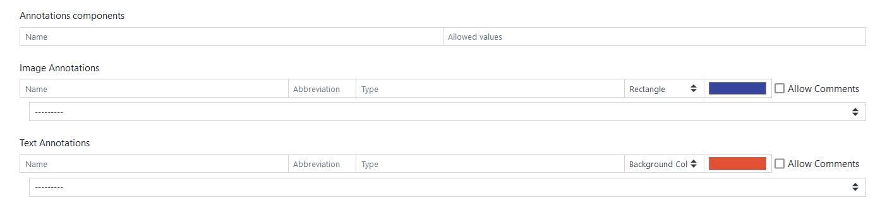
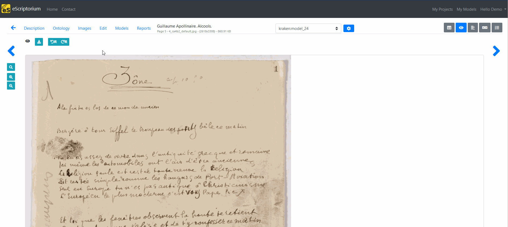
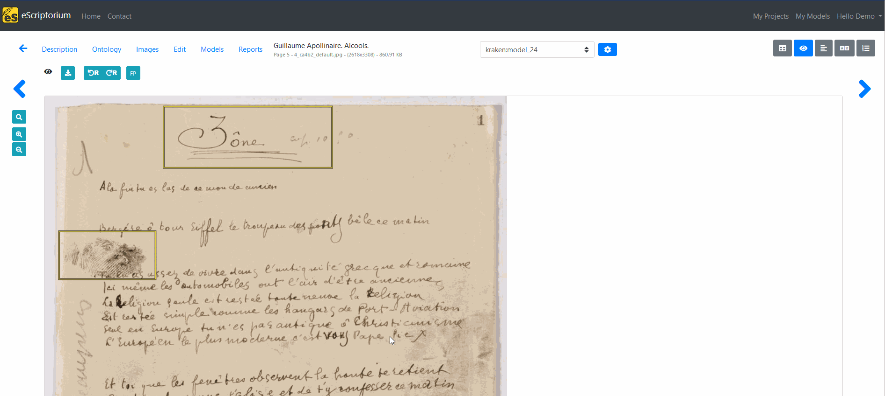
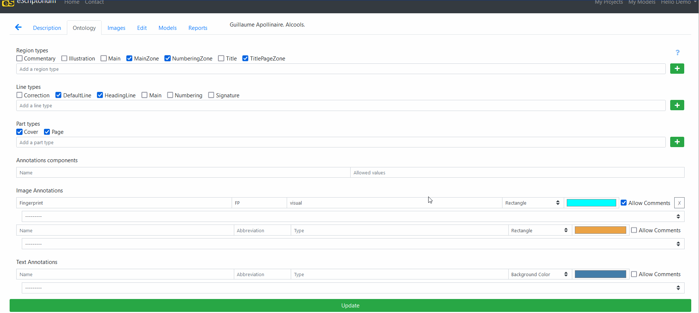
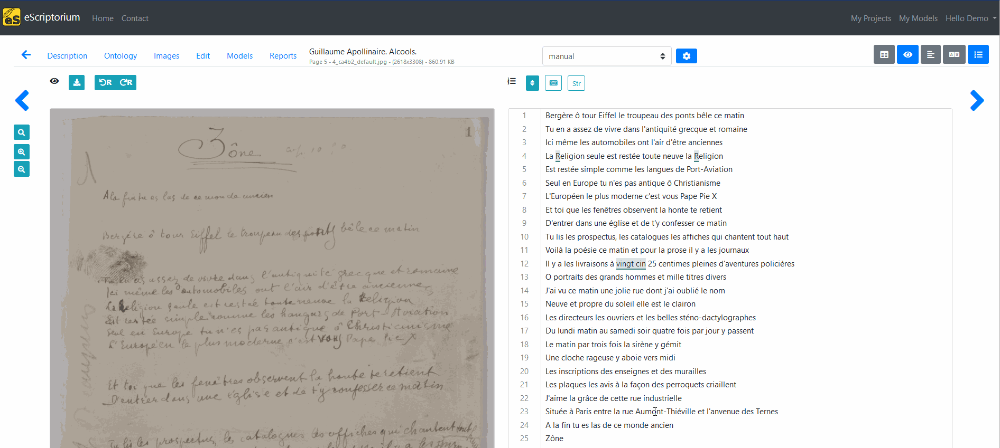

# Annotation in eScriptorium

!!! Note
    This section details the "Annotation" components, not the "Segmentation" features, which are two different things.

Annotation can be performed at two levels:  

- at image level
- at text level

The different categories that you want to use for annotation are activated and managed from a document's "Ontology" page (also accessible at `{base_url}/document/{doc_id}/ontology`). See in particular in the 3 last items of the page:  

- Annotation components
- Image Annotations
- Text Annotations

## Annotation components

!!! Warning
    This section needs to be completed.

## Image annotations

### Create a new category

To create an new category for image annotation, go to the "Ontology" tab, then in "Image Annotations", fill a new line with the following information:  

- Name of the category
- Abbreviation (3 letters max)
- Type
- Select the marker type (rectangle or polygon) depending on the type of shape you want to draw
- Leave the default color or change it
- Check "Allow Comments" if you want to be able users to comment on the annotations

Once a new category is created, the value of "Abbreviation" will be used to create a button in the "Source Image" panel in the "Edit" page.  

!!! Note "On the importance of the value of the Abbreviation field"
    The value entered in the Abbreviation field is very important because if you change this value later, it will equate to [deleting the existing category](#delete-a-category-for-image-annotation) and creating a new one. On the contrary, you can change the value of all the other fields without losing the existing annotations of that category.  

### Draw an annotation on an image

To draw an annotation on an image, go to the "Edit" page and activate the "Source Image" panel (++control+1++). Click on the button corresponding to the desired category, then draw the shape on the image. If commenting is allowed, a dialog box will appear with a text field.  

As mentioned above, there is two markers type (rectangle or polygon) and the method to draw them is different:

- To draw a rectangle, put the mouse on the top left corner of the part to annotate. Click on the mouse while sliding to the bottom right corner and then stop clicking. The rectangle will be created.
- To draw a polygon, click on the mouse from one point around the part to annotate to another not far from it. Then, release the mouse and go to another point, click on the mouse and continue until the polygon is drawn. Once at the last point of the polygon, double click on the mouse to release. The polygon will be created.

 over a fingerprint, in the Source Image panel, after activating the 'FP' button")

 over a fingerprint, in the Source Image panel, after activating the 'FP' button")

### Remove an annotation from the image

To remove an annotation from the image, click on it and press the trash-can icon. It is also possible to press ++delete++ after selecting the annotation.

### Delete a category for image annotation

!!! Note
    If you delete an annotation category from a document's ontology, all the annotations corresponding to that category will be removed as well.

To delete an existing category for image annotation, go to "Ontology", then activate the "X" button at the end of the description of the category, then click on "Update".  

## Text annotations

Text annotation is very similar to Image annotation: you can create, remove, modify them from the document's ontology page.  

To apply a text annotation, activate the "Text" panel from the Edit page (or ++control+4++). Click on the button corresponding to the category of annotation you want to add and then select a portion of text. Click on "OK" to save the annotation.  

Removing a text annotation is similar to removing an image annotation: click on the annotation and click on the trash-can icon.

## Exporting text and image annotations

!!! Warning  
    This section needs to be completed.

<!-- We need feedback from users and the SCRIPTA team to complete this section -->