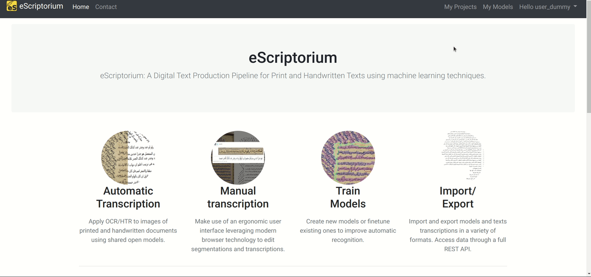

# Walkthrough: collaborate within eScriptorium

eScriptorium allows collaboration between users of the same instance with features such as teams and sharing.

## Teams

Users can be grouped inside a team. The main purpose of teams is to facilitate [sharing documents or projects](#share-a-project-or-a-document). Teams are also helpful to identify a group of people working on the same project or coming from the same institution. Users can be part of several teams at a time.  

It is possible to manage teams from the [Profile page](users.md#review-and-edit-your-profile). Team management includes:  

- Creating a team,  
- Leaving a team,  
- Adding or removing members from a team,  
- Transfering ownership to another member.  

Only the owner of a team is allowed to add or remove members or to transfer ownership. The owner of a team cannot leave it without first transferring the ownership to another user.

??? Note "No deleting, no renaming"
    It is currently impossible to delete a team or to rename a team.

??? Note "One owner per team"
    There can only be one owner at a time.

## Invite a user

In eScriptorium, some users can have the right to invite new users. The invitation rights are not activated for everyone.

You can find more information about inviting new users in the [user-related features walkthrough](users.md#invite) section.

## Share a project or a document

You can share projects and documents with others users of the same eScriptorium instance.

### Share a project

You can share a project you own by clicking on the "Share this project" button, located in the project dashboard at `{base_url}/project/{project_slug}/documents/`. **Only the owner of a project can share it.** It will then open a pop-up box where you have two elements:

1. A field in which you can enter any username existing on your eScriptorium instance. There is no auto-completion for username, so you need to know by your own means another person's username on that instance.
2. A succession of tick boxes associated to usernames belonging to the team you are a part of. You can check as many boxes as you want.

Then you can click on the "Share" button, a green pop-up message will then be displayed stating that sharing is successful.

!!! Note
    If you enter an incorrect username, the application will still consider that sharing was successful and will then displayed the green pop-up message. One way to make sure the project is actually shared to the user you want is to click again on "Share this project" and check that they appear in the list of Users, with the box checked.

### Share a document

Go to a document you own and that you want to share, and then click on the "Description" tab. You can then click on the "Share this document" button, and the same pop-up box used for sharing a project will open.

### Stop sharing a project or a document

You can stop sharing a project or a document in the same pop-up box as for sharing. You only need to uncheck tick boxes associated to usernames.

## Share models  

### Share a model

eScriptorium allows you to share your models with the other users of your eScriptorium instance.

To do so, go to the "My Models" page, accessible via the navigation bar, in the upper right section of the interface, or via `{base_url}/models/`.

Click on the "Share model" button. It will open a new URL, `{base_url}/models/{your model's number}/rights/`, where you can choose to share a model to users from the teams you belong to, or to a whole team.

Choose a user or a team from either one of the two dropdown menus, and click on the "Add right" button.

All users or teams you shared the model with are also listed here. Users will have the `User` type, and teams the `Group` type. You also have the name of the user or the team, and the full name or identifier.

!!! Note
    You can only share a model that you own.

### Stop sharing a model

You can stop sharing a model to a specific user or team by clicking on the "Stop sharing" button.
