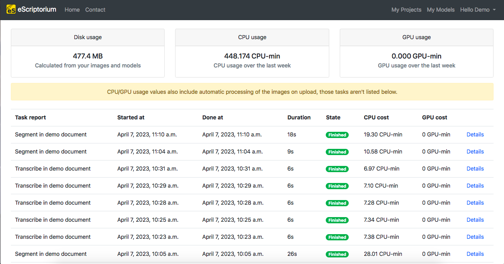
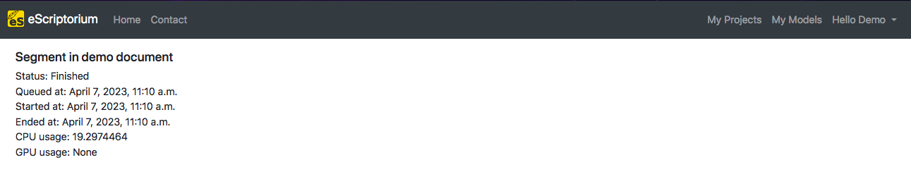
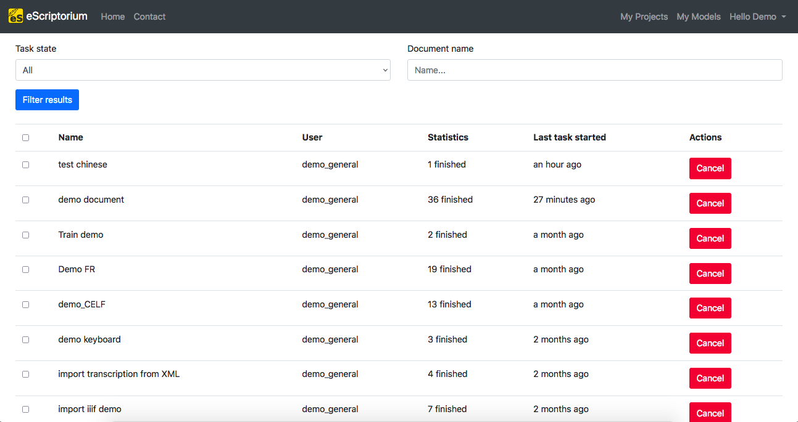

# Predict with eScriptorium

In eScriptorium, it is possible to automatically generated a transcription or a segmentation, i.e. to predict it, generally after you [trained a model](train.md) for it. This prediction, whether it is of the segmentation or the transcription, is managed from the "Images" tab: `{base_url}/document/{document-id}/images/`

## Predict the segmentation

In the "Images" tab, select the image(s) you would like to see segmented by ticking the checkbox(es) in the top-left corner of the image thumbnail. Then, click on the "Segment" button, at the right of the page. A pop-up box will appear, which will give you the possibility to configure the segmentation you want for your images, thanks to three dropdown menus:

- The first menu gives you the possibility to choose the segmentation model you want to use for your prediction.  
- The second menu allows you to manage what level of segmentation is carried out:
    - “Line and Regions” leads to the generation of zones, baselines and associated polygons.
    - “Line Baselines and Masks” leads to the generation of baselines and associated polygons (no zone will be created).
    - “Only line Masks” does not require loading a model; this option allows you to reset on the fly the calculation of the polygons associated with the baselines already present on the images.
    - “Regions” leads to the generation of zones only. It makes it possible to keep intact the baselines and polygons already present on the images.

<!-- note: consider adding an illustration of what each mode mean -->

- The third menu is used to indicate the reading direction of the lines:
    - Horizontal l2r = read horizontally from left-to-right.
    - Horizontal r2l = read horizontally from right-to-left.
    - Vertical l2r = Vertical script texts read from left-to-right.
    - Vertical r2l = Vertical script texts read from right-to-left.

Finally, the "Override" checkbox is here in case the document has already been segmented and you apply a new prediction. By ticking the checkbox, you chose to erase the existing segmentation and, if it existed, the transcription already applied to the images. 

!!! warning
    By default, the checkbox is ticked, so be careful to uncheck it if you don't want to erase the existing segmentation.

    On the other hand, if you deactivate it, you might end up with several layers of zones or lines identical to each other.

After you finish setting the segmentation, click on "Segment". It will start the process, which is signaled by the blinking yellow buttons appearing on the image thumbnail. These buttons can be used to stop the prediction, image by image. When the prediction task is finished on an image, the yellow box disappears from the thumbnail and a pop-up message appears in the top-right corner.

<!-- unnecessary precision + too focused on the current display
!!! Note
    As the segmentation is done page by page, the green message will appear as soon as the first image chosen is segmented. Then, if you have more than one image segmented, a number in parenthesis will appear next to the "Segmentation done!" message and every time a new segmentation is finished, the number will go up, until all of the selected images has been segmented.
-->

## Predict the transcription

In the "Images" tab, select the image(s) you would like to transcribe by ticking the checkbox(es) in the top-left corner of the image thumbnail. Then, click on the "Transcribe" button. A pop-up box will appear, where you can choose the model to apply. 

Then, clicking on "Transcribe"  will start the transcription task. Its execution is signaled by the blinking yellow buttons appearing on the image thumbnail. These buttons can be used to stop the prediction, image by image. When the prediction task is finished on an image, the yellow box disappears from the thumbnail and a pop-up message appears in the top-right corner.

<!-- unnecessary precision + too focused on the current display
!!! Note
    As the transcription is done page by page, the green message will appear as soon as the first image chosen is transcribed. Then, if you have more than one image transcribed, a number in parenthesis will appear next to the "Transcription done!" message and every time a new transcription is finished, the number will go up, until all of the selected images has been transcribed.
-->

## Task reports and task monitoring

### Task reports

<!-- redundant with Task reports in walkthrough_users, might be difficult to maintain -->
You can reach a page displaying reports on tasks execution by clicking on your username in the navbar and selecting "Task reports" (also reachable via `{base_url}/quotas`).

The "Task reports" page displays information on:

- the disk, CPU and GPU usage of your account.
- the tasks associated to your account (such as segmentation, transcription, training, etc.), including the dates and times of the start and end of the task, duration, state (finished, canceled, etc.), the CPU and GPU usage, as well as some extra "Details".

### Task monitoring

<!-- redundant with Task monitoring in walkthrough_users, might be difficult to maintain -->
You can reach a page displaying information on ongoing tasks by clicking on your username in the navbar and selecting "Task monitoring" (also reachable via `{base_url}/document/tasks`).

The "Task monitoring" page allows you to observe all the tasks that were associated to your profile, with information on the name of the task, the user who started it, statistics about how much was done and in what state, a timeline of it and the possibility to do some action on it. It is also possible to filter the results by document or by the state of the task (All, Queued, Running, Crashed, Finished, Canceled).

