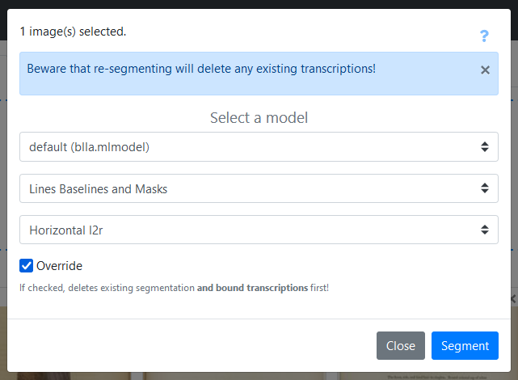

!!! warning
    The section needs to be completed.

In this section, we offer a short tutorial which goal is to get you accounted with the interface of eScriptorium and some basic actions that can be performed on the application.

First of all, you need to ensure that you [possess an account](FAQ.md#how-can-i-have-an-escriptorium-account) either on a local installation of eScriptorium or on an online server. Then you can follow the instructions below:

[TOC]

## Forewords on URL syntax

eScriptorium is a decentralized application, meaning it can be deployed on many servers, including on locally simulated servers. In such condition, it is impossible to point to a URL which would work for every person. For this reason, we use what we think is a universal syntax to point to specific URLs: **place holders**. For example, if the eScriptorium application you have access to is located at `escriptorium.demo`, then "escriptorium.demo" is the `base URL` to any pages inside the application. In such a case, you should understand a URL such as `{base_url}/login/` as meaning `escriptorium.demo/login` (the placeholder `{base_url}` is replaced with your base URL). This is also true for local instances of eScriptorium, generally served at `localhost:8000` (where `{base_url}/login/` would be replaced with `localhost:8000/login/`). This syntax is used throughout this documentation.

## Logging into the application

As long as you are not logged in the application, many pages will not be accessible to you. To log in the application, go to your application homepage, and click on "Login", then enter your username and your password. You can find more information about this step [here](users.md#login-and-logout).

")

After successfully logging in, you are sent to `{base_url}/projects/` which is your overall dashboard. This page can also be accessed by clicking on "My Projects" in the top navigation bar (the link only appears when you are logged in).

## Creating a new project

In eScriptorium, the data is organized inside **projects** which contain **documents**, which in turn contain **document-parts**.
<!-- todo: this section might change if you explain this somewhere else, even though it makes sense to have it explained here -->

- A document-part is simply an image (a digitization) of a document: it can be the photography of a double page, a single page, or even cropped portion of such images. 
- A document is a collection of such images, similar to how you would organize a directory containing images on your file system.
- Projects can be understood as one more level to gather documents (groups of images) together, but they can be envisioned as workspace for a group of users working for the same project. For example, tags <!--todo: add link to page explaining tag when available --> are managed at project level, available for all the documents inside the given project.<!-- todo: send to voc section once there is one -->

You need to have at least one project in your dashboard to create and/or access a document and use eScriptorium's annotation features. Let's create a new project then!

Go to "My Projects" (`{base_url}/projects/`) by clicking on "My Projects" in the nav bar. It will display a list of projects, or an empty page. Now click on the "Create new Project" button: it will open a new page where you can simply type the name of your future project before clicking on "Create". For this tutorial, let's name the project "Sandbox project".

!!! Danger "Before creating a new project"
    Currently, **it is not possible to delete or rename a project**. We strongly advise you to first consider the actual necessity of creating a new project, and secondly to give enough reflection time to choosing the name of your new project. For example, you should avoid names such as "1" or "project" or "blah blah" to make it easier for you identify your projects later, when you will have several projects.  
    Also, note that if you share your project or a document in this project with another user, they will not be able to rename your project and will see the project name you chose: **the name of the project should be meaningful and compatible with sharing it with other users** (avoid such names as "this is my project" for example).

")

## Creating a new document

As detailed in the [walkthrough](walkthrough.md) section, you can only [import](import.md) images and data inside a document. So, let's now create a document!

To access your project dashboard, go to "My Projects" (`{base_url}/projects/`), then click on the name of your project (it should be "Sandbox project" if you followed the instructions from the previous step). The project dashboard displays a list of documents belonging to the project. It is currently empty since we just created the project. Click on "Create new Document" to open a form and create a new document.

This form is much more detailed than the one to create a project, but many of these fields are optional:

- **(mandatory) the document's name:** it will be the name of the document as displayed on the project dashboard, you will be able to change it as many times as you want, but you should probably not make it too long. Let's fill it with "Gallery of Fashion (01/1800)".
- **(optional) the main script:** this is an element of metadata, it will not have any impact of the way the document is handled by the application. In the case of our tutorial, we will import a printed document written in English, so we select "Latin": English is written with the Latin alphabet. You could decide to leave it empty.
- **(mandatory) read direction:** you mush choose the reading direction of your document (left to right or right to left). For this tutorial, since the document is in English, we opt for "left to right". This parameter is very important because it will change how eScriptorium handles the reading direction of your [segments](segment.md). <!-- todo: add link to section of segment that would explain what happens when not set correctly -->
- **(mandatory) line offset:** let's set it to "baseline" (if you want more information on this option, see the [segment](segment.md) <!-- todo: add link to section of segment that would normally explain that --> section.)
- **confidence visualization checkbox:** as explained further in the documentation <!-- todo: add a link when the doc exists --> checking this box will slightly change the way the transcription appear in the application. Let's leave it unchecked.
- **(optional) metadata:** this is a series of free fields where you can associate a value to a key. For example, this allows you to keep track of all the annotators working on your document. When [importing images via IIIF](import.md#3-from-iiif), this section of the document is automatically filled with the metadata contained in the IIIF manifest. You can edit this section as many times as you want. For now, let's just put the ARK <!-- todo: add explanation on what ARK is --> identifier from the French national library, where the images were taken from: 

    > "BnF ID" = "ark:/12148/bpt6k10750420"[^1].

[^1]: If you add `https://gallica.bnf.fr/` in front of this value, you will be able to view [the whole document on Gallica](https://gallica.bnf.fr/ark:/12148/bpt6k10750420/), the French national library's online library.

Once you click on "Create", at the bottom of the form, a green message will appear, confirming the creation of the new document. You can modify any information in this form and click on the button now displaying "Update" to save the changes.

")

Before moving on to the next step, make sure your form contain the following information:

## Importing images

<!-- todo: doable only when IIIF import from Gallica will not be so limited that import misses some images... -->
<!--We will use the [IIIF import](import.md#3-from-iiif) feature, but if it does not work correctly for you, you can also download the corresponding images [here](#) -->
<!-- and follow the documentation on how to [import images from the local file system](import.md#1-from-the-local-file-system). -->
<!-- example images are taken from https://gallica.bnf.fr/iiif/ark:/12148/bpt6k10750420/manifest.json -->

Let's import images [from the local file system](import.md#1-from-the-local-file-system) in order to process them with eScriptorium.

First, you need to download the file located [here](files/demo_images.zip) and unzip the resulting file.

It contains 5 images taken from the French national Library's online library, Gallica, in particular from the document called "[Gallery of Fashion](https://gallica.bnf.fr/ark:/12148/bpt6k10750420)", printed in London in january 1800. The images contain text blocks and illustrations with legends.

To import them in the application, got to the corresponding document's dashboard and click on the "Images" tab (`{base_url}/document/{document_id}/images/`). Click in the "dropping" area to open the file explorer and select the images. Do not refresh the page until all the images are loaded: for each of the image, a new thumbnail appear. If you go back to the project's dashboard, you can see that our document now contains 5 images.

## Detecting the Layout of the documents

Now that the images are loaded on the application, we need to apply a segmentation model in order to detect the layout of the documents and locate the lines of text. This step is necessary before applying a recognition model to predict the transcription.

Let's go back to the document's dashboard and click on the "Images" tab (`{base_url}/document/{document_id}/images/`). Each thumbnail allows us to interact with one of the document's pages. Select the first page by click on the checkbox at the top of thumbnail (it should become black) and then click on the "Segment" button just above.

As explained [in the documentation](segment.md#overview-of-the-segmentation-panel), it will open a panel where we can enter a configuration for the segmentation and layout detection task.

To familiarize with the segmentation interface, we will start with solely detecting the lines on the image. Select the default segmentation model ("default (blla.mlmodel)"), the "Lines Baselines and Masks" and the "Horizontal l2r" options. Make sure the "Override" box is checked and click on "Segment". While the segmentation task in running, a yellow button appears on the thumbnail: it allows you to stop the process if necessary.

Once the task is over, it is possible to see the result by clicking on the "Edit" button, on the thumbnail.

## Loading and applying a transcription model

Ideally, you should always control the result of the segmentation step before starting a text recognition task. To demonstrate the importance of this control, let's skip it for now and move on to apply a recognition model.

Contrary to the segmentation task, eScriptorium does not systematically provide a default recognition model for the transcription task. Since our document contains printed English, we will use the Manu McFrench model. It is normally designed for French texts, but it is capable of reading printed English as well with relatively good results.

!!! Note
    You can skip this part if you already have access to the Manu McFrench model in your application. To know whether or not it is the case, go to the models page by clicking on "My Models" in the top nav bar.
    
    On Inria's eScriptorium server, for example, several models are "public", which means they are accessible to all users. Manu McFrench is among them.

    

Click on [this link](https://doi.org/10.5281/zenodo.6657809) and download the "HTR-United-Manu_McFrench.mlmodel" file. Let's now [import the model](import.md#import-models) on the application: click on "My Models" in the navigation menu at the top of the window, then click on "Import a model". It will open a new page (`{base_url}/models/new/`) where you select the model to upload and give it a name ("HTR-United-Manu_McFrench (demo)" in the case of our demo). Click on "Upload" and wait until the model is loaded: it now appears in the list of models.

Now that we have a transcription model, let's go back to our document dashboard. Starting a recognition task is similar to starting a segmentation tasks: we select the first image (the image we previously segmented) by checking the box at the top of the thumbnail and click on the "Transcribe" button. A shorter form appear, where we select the recognition model used to transcribe the document. If you successfully uploaded Manu McFrench previously, the model now appears in the list of available models. Select it, and click on "Transcribe". Like before, a yellow button appears on the thumbnail, allowing you to stop the process if necessary.

Once the task is over, it is possible to see the result by clicking on the "Edit" button, on the thumbnail.

!!! Note
    When you click on "Edit" after transcribing a document for the first time, you may not see an text at first: it is because you are, by default, viewing the "manual" transcription version. You need to [switch the displayed transcription version](transcribe.md#transcription-versions) to the one generated during the transcription in order to see the generated text.

Remaining steps:

- then correct the segmentation, maybe remove some lines and/or add regions
- verify that the lines are associated with a regions, and verify the reading order
- then apply a transcription model
- then manually correct the transcription
- then export the result with the images

Then point to other useful pages to go further.
