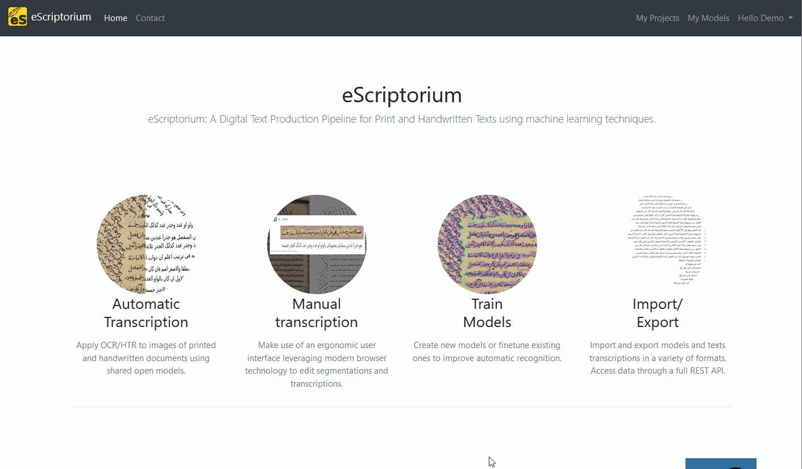

!!! warning
    The section needs to be completed.

In this section, we offer a short tutorial whose goal is to get you acquainted with the interface of eScriptorium and some basic actions that can be performed on the application.

First of all, you need to make sure that you [possess an account](FAQ.md#how-can-i-have-an-escriptorium-account) either on a local installation of eScriptorium or on an online server. Then you can follow the instructions below:

[TOC]

## Forewords on URL syntax in this tutorial

eScriptorium is a [decentralized application](index.md), meaning it can be deployed on many servers, including on [locally simulated servers](FAQ.md#is-escriptorium-accessible-offline). In such conditions, it is impossible to point to a URL which would work for every person. For this reason, we use what we think is a universal syntax to point to specific URLs inside an instance of the application: **place holders**.  

For example, if the eScriptorium application you have access to is located at `escriptorium.demo`, then "escriptorium.demo" is the `base URL` to any page inside the application. In such a case, you should understand a URL such as `{base_url}/login/` as meaning `escriptorium.demo/login` (the placeholder `{base_url}` is replaced with your actual base URL). This is also true for local instances of eScriptorium, generally served at `localhost:8000` (where `{base_url}/login/` would be replaced with `localhost:8000/login/`).

This syntax is used throughout this documentation.

## Logging into the application

As long as you are not logged in the application, many pages will not be accessible to you. To log in the application, go to your application homepage, and click on "Login", then enter your username and your password. You can find more information about this step [here](users.md#login-and-logout).

")

After successfully logging in, you are sent to `{base_url}/projects/` which is your overall dashboard. This page can also be accessed by clicking on "My Projects" in the top navigation bar (the link only appears when you are logged in).

## Creating a new project

In eScriptorium, the data is organized inside **projects** which contain **documents**, which in turn contain **document-parts**.
<!-- todo: this section might change if you explain this somewhere else, even though it makes sense to have it explained here -->

- A *document-part* is simply an image (a digitization) of a document: it can be the photography of a double page, a single page, or even cropped portion of such images.  
- A *document* is a collection of such images, similar to how you would organize a directory containing images on your file system.
- *Projects* can be understood as one more level to gather documents (themselves groups of images), but they can be envisioned as workspaces for a group of users working for the same project. For example, tags <!--todo: add link to page explaining tag when available --> are managed at project level, available for all the documents inside the given project.<!-- todo: send to voc section once there is one -->

You need to have at least one project in your dashboard to create and/or access a document and use eScriptorium's annotation features. Let's create a new project then!

Go to "My Projects" (`{base_url}/projects/`) by clicking on "My Projects" in the nav bar. It will display a list of projects, or an empty page. Now click on the "Create new Project" button: it will open a new page where you can simply type the name of your future project before clicking on "Create". For this tutorial, let's name the project "Sandbox project".

!!! Danger "Before creating a new project"
    Currently, **it is not possible to delete or rename a project**. We strongly advise you to first consider the actual necessity of creating a new project, and secondly to give enough reflection time to choosing the name of your new project. For example, you should avoid names such as "1" or "project" or "blah blah" to make it easier for you identify your projects later, when you will have several projects.  
    Also, note that if you share your project or a document with another user, your project will appear in their list of projects as you named it. Therefore, **the name of the project should be meaningful and compatible with sharing it with other users** (avoid such names as "my project" for example).

!!! Note "Skip this step if..."
    Skip this step if you already have a project you can use as a sandbox.

")

## Creating a new document

As detailed in the [walkthrough](walkthrough.md) section, you can only [import](import.md) images and data inside a document. So, let's now create a document!

To access your project dashboard, go to "My Projects" (`{base_url}/projects/`), then click on the name of your project (it should be "Sandbox project" if you followed the instructions from the previous step). 

The project dashboard displays a list of documents: it is currently empty since we just created the project. Click on "Create new Document" to open a form and create a new document.

This form is much more detailed than the one to create a project, but many of these fields are optional:

- **(mandatory) the document's name:** it will be the name of the document as displayed on the project dashboard, you will be able to change it as many times as you want, but you should probably not make it too long. Let's fill it with "Gallery of Fashion (01/1800)".
- **(optional) the main script:** this is an element of metadata, it will not have any impact of the way the document is handled by the application. In the case of our tutorial, we will import a printed document written in English, so we select "Latin": English is written with the Latin alphabet. You could decide to leave it empty.
- **(mandatory) read direction:** you must choose the reading direction of your document (left to right or right to left). For this tutorial, since the document is in English, we opt for "left to right". This parameter is very important because it will change how eScriptorium handles the reading direction of your [segments](segment.md). <!-- todo: add link to section of segment that would explain what happens when not set correctly -->
- **(mandatory) line offset:** let's set it to "baseline" (if you want more information on this option, see the [segment](segment.md) <!-- todo: add link to section of segment that would normally explain that --> section.)
- **confidence visualization checkbox:** as explained further in the documentation <!-- todo: add a link when the doc exists --> checking this box will slightly change the way the transcription appear in the application. Let's leave it unchecked.
- **(optional) metadata:** this is a series of free fields where you can associate a value to a key. For example, this allows you to keep track of all the annotators working on your document. When [importing images via IIIF](import.md#3-from-iiif), this section of the document is automatically filled with the metadata contained in the IIIF manifest. You can edit this section as many times as you want. For now, let's just put the ARK <!-- todo: add explanation on what ARK is --> identifier from the French national library, where the images were taken from:  

    > "BnF ID" = "ark:/12148/bpt6k10750420"[^1].

[^1]: If you add `https://gallica.bnf.fr/` in front of this value, you will be able to view [the whole document on Gallica](https://gallica.bnf.fr/ark:/12148/bpt6k10750420/), the French national library's online library.

Once you click on "Create", at the bottom of the form, a green message will appear, confirming the creation of the new document. You can modify any information in this form and click on the button now displaying "Update" to save the changes.

")

Before moving on to the next step, make sure your form contains the following information:

## Importing images

<!-- todo: doable only when IIIF import from Gallica will not be so limited that import misses some images... -->
<!--We will use the [IIIF import](import.md#3-from-iiif) feature, but if it does not work correctly for you, you can also download the corresponding images [here](#) -->
<!-- and follow the documentation on how to [import images from the local file system](import.md#1-from-the-local-file-system). -->
<!-- example images are taken from https://gallica.bnf.fr/iiif/ark:/12148/bpt6k10750420/manifest.json -->

Let's import images [from the local file system](import.md#1-from-the-local-file-system) in order to process them with eScriptorium.

First, you need to download the file located [here](files/demo_images.zip) and unzip the resulting file.

It contains 5 images taken from the French national Library's online library, [Gallica](https://gallica.bnf.fr), in particular from the document called "[Gallery of Fashion](https://gallica.bnf.fr/ark:/12148/bpt6k10750420)", printed in London in january 1800. The images contain text blocks and illustrations with legends.

To import them in the application, got to the corresponding document's dashboard and click on the "Images" tab (`{base_url}/document/{document_id}/images/`). Click in the "dropping" area to open the file explorer and select the images. Do not refresh the page until all the images are loaded! 

For each of the image, a new thumbnail appears. If you go back to the project's dashboard, you can see that our document now contains 5 images.

## Detecting the Layout of the documents

Now that the images are loaded on the application, we need to apply a segmentation model in order to detect the layout of the documents and locate the lines of text. This step is necessary before applying a recognition model to predict the transcription.

Let's go back to the document's dashboard and click on the "Images" tab (`{base_url}/document/{document_id}/images/`). Each thumbnail allows you to interact with one of the document's pages. Select the first page by clicking on the checkbox at the top of thumbnail (it should become black) and then click on the "Segment" button just above.

As explained [in the documentation](segment.md#overview-of-the-segmentation-panel), it will open a panel where we can enter a configuration for the segmentation and layout detection task.

To familiarize with the segmentation interface, we will start with solely detecting the lines on the image. Select the default segmentation model ("default (blla.mlmodel)"), the "Lines Baselines and Masks" and the "Horizontal l2r" options. Make sure the "Override" box is checked and click on "Segment". While the segmentation task in running, a yellow button appears on the thumbnail: it allows you to stop the process if necessary.

Once the task is over, it is possible to see the result by clicking on the "Edit" button, on the thumbnail.

## Loading and applying a transcription model

Ideally, you should always control the result of the segmentation step before starting a text recognition task. To demonstrate the importance of this control, let's skip it for now and move on to apply a recognition model.

### Fetch and load a transcription model  

Contrary to the segmentation task, eScriptorium does not systematically provide a default recognition model for the transcription task. Since our document contains printed English, we will use the Manu McFrench model. It is normally designed for French texts, but it is capable of reading printed English as well with relatively good results.

!!! Note "Skip this part if..."
    You can skip this part if you already have access to the Manu McFrench model in your application. To know whether or not it is the case, go to the models page by clicking on "My Models" in the top nav bar.
    
    On Inria's eScriptorium server, for example, several models are "public", which means they are accessible to all users. Manu McFrench is one of them.

    

Click on [this link](https://doi.org/10.5281/zenodo.6657809) and download the "HTR-United-Manu_McFrench.mlmodel" file.  

Let's now [import the model](import.md#import-models) on the application: click on "My Models" in the navigation menu at the top of the window, then click on "Import a model". It will open a new page (`{base_url}/models/new/`) where you select the model to upload and give it a name ("HTR-United-Manu_McFrench (demo)" in the case of our demo). Click on "Upload" and wait until the model is loaded: it now appears in the list of models.

### Apply a transcription model

Now that we have a transcription model, let's go back to our document dashboard. Starting a recognition task is similar to starting a segmentation tasks: we select the first image (the image we previously segmented) by checking the box at the top of the thumbnail and click on the "Transcribe" button.

A shorter form appears, where we select the recognition model to be used. If you successfully uploaded Manu McFrench previously, the model now appears in the list of available models. Select it, and click on "Transcribe". Like before, a yellow button appears on the thumbnail, allowing you to stop the process if necessary.

Once the task is over, it is possible to see the result by clicking on the "Edit" button, on the thumbnail.

!!! Note "Where is the transcription?"
    When you click on "Edit" after transcribing a document for the first time, you may not see an text at first: it is because you are, by default, viewing the "manual" transcription version. You need to [switch the displayed transcription version](transcribe.md#transcription-versions) to the one generated during the transcription in order to see the generated text.

## Manually correct the segmentation and the transcription

Let's look at the result of our automatic segmentation and transcription. Click on the "Edit" button and make sure to activate the "Segmentation" (++ctrl+3++) and "Transcription" (++ctrl+4++) panels. You can deactivate the other panels. <!-- todo: add a link to an overview description of the panels -->

In the image below, we see that one line was incorrectly segmented (therefore its transcription is incomplete) and a total of 8 segments contains incorrect transcriptions. We highlighted the errors in red.

### Fix the segmentation

First, let's correct the segmentation. Set the zoom at a comfortable level and use the right-click (and hold) to center the image. Then activate the incorrectly drawn segment by clicking on the blue line (the baseline<!--todo: add link to corresponding documentation-->). When the line is active, small white squares appear for each of the points through which the line passes. They are black when they are active. You can move the points to correct the shape of the line. Let's first correct the end point: we only need to click and hold on the portion of the segment the closest to the point, then when we move the cursor, the line will change. We can fix both points. At the end, the segment should be drawn in such a way that it follows the base of line (it is called a baseline after all).

When you are satisfied and want to deactivate the line, you can press ++escape++ or click anywhere **outside** of the segmentation panel.

!!! Note
    If you click inside the segmentation panel, you will deactivate the line but you will also start drawing a new line. Press ++escape++ if this happens.

If this is too difficult, you can also make the line active (click on the blue line) and press the red button showing a trash icon on the side of the panel (or press ++delete++). It will delete the line and you can draw a new one. In such a case, you lose the transcription that had been created for the deleted segment.

You can find many more functionalities for the segmentation panel on the [dedicated page](segment.md). Keep in mind that the segmentation panel is the feature in eScriptorium that requires the most dexterity: it can seem difficult to use at the beginning, but once you get use to it, fixing the result of an automatic segmentation can be very quick. For some people, it is easier to use a mouse instead of a track pad.

Let's do one more modification in the segmentation panel: we can add a region to group the lines that were detected.

!!! Note "You can skip this part if..."
    You don't have to do this part if you are not comfortable with the segmentation panel, it will not be necessary for the rest of the tutorial.

Regions are essential to organize the lines on an image : they allow you to group lines together<!-- todo: add link to regions description in the segmentation page-->. Switch to "region mode" by clicking on the corresponding button at the top of the segmentation panel (or press ++r++). Now, if you click anywhere on the segmentation panel, you will start drawing a region (a rectangle). Click anywhere else on the image to finish drawing the region.

As for lines, you can activate a region by clicking on it. You can then change its shape by moving the points (click and hold next to a point then move the cursor), or even double click inside the active region, next to a border to create a new point. Note that there more things to do with regions, they are described in the [segmentation page](segment.md).

Once you are satisfied with the shape of you region, click outside the segmentation panel to deactivate the region. You can also directly switch back to line mode by clicking on the corresponding button at the top of the segmentation panel.

Back in line mode, you can select several lines at a time : hold ++shift++ down and click and hold anywhere on the segmentation panel to start drawing a selection region. Then use the button on the left side of the image to link the selected line to the region (or press ++y++). You can also unlink them (++u++).

The lines linked to a region will now be considered as one logical block. Lines that are not linked to a region are called "orphan lines" in the application.<!-- todo: add a link to how you can easily spot orphan line using the "display order" button in the segmentation panel -->

To finish this step, you can reset the zoom (click on the corresponding button on the left of the image or press ++control+backspace++), switch back to region mode to draw two more regions, then switch back to line mode. One easy way to make sure that no line is an orphan is use the ++control+a++ shortcut (select all) and press ++y++. The lines are automatically assigned to the regions on top of which they are drawn.

!!! Tip "About shortcuts"
    We have already seen a lot of shortcuts so far! Don't worry, you don't have to memorize them all! You can hover over a button to see if it corresponds to a shortcut. You can also click on the "?" icon at the top of the segmentation panel for some useful tips! <!-- todo: add link to shortcut page!-->

### Fix the transcription

Fixing the transcription is easier. You can find a lot of information on how to handle manual annotation for the transcription in the [dedicated page](transcribe.md).

First, let's use the segmentation panel to control the order of the lines. We only have one column of text, so our lines should be read from top to bottom. Click on the "Toggle ordering display" button (or press ++l++).

If you need to fix the order of the line, you can check the documentation [here](segment.md#reordering).

Now, let's click on the first line, in the ["Transcription" panel](transcribe.md#editing-with-the-transcription-panel), and use the interface to correct the text. Pressing ++enter++ allows us to save the modification and move to the next segment of text.

!!! Tip "Some keys don't work?"
    Sometimes, when both the segmentation and the transcription panels are active, the browser doesn't know how to interpret our pressing the keys, especially when they correspond to short cuts. This is often the case with the letter "T". To avoid this, you can simply refresh the page after having used the segmentation panel.

## What next?

At this point, we have covered a lot of common features for eScriptorium and got you familiar with the interface. You can keep practicing with the 4 remaining document parts, or you can load some of you own documents to start practicing on more familiar pages. Once you are satisfied with you transcription, you can [export](export.md) the corresponding transcription to different formats. You can also try [sharing](collaborate.md#share-a-project-or-a-document) your project or your documents with other users. Once you have annotated enough images, you can even try [training](train.md#training-models-with-escriptorium) a transcription or a segmentation model.

There many advanced features that are worth reading about: the [virtual keyboard](virtual_keyboard.md), the [API](api.md), the [tags](#)<!--todo: add the link --> to name a few! <!-- we could add: the typing system and the ontology tab, the annotation too!, the repot tabs -->

!!! Note
    IF you liked this tutorial and found it useful, or if on the contrary you found it could be improved, please, send us a message or [contribute](contribute.md) to this documentation!
