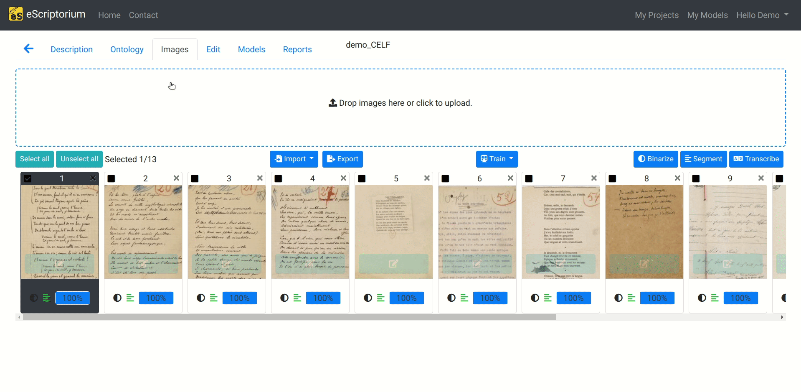
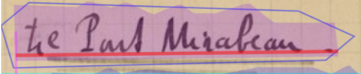
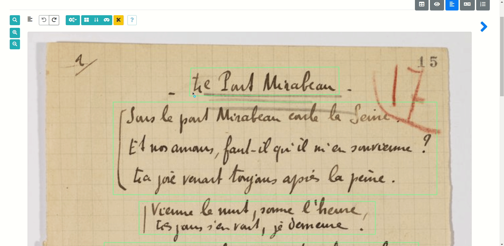
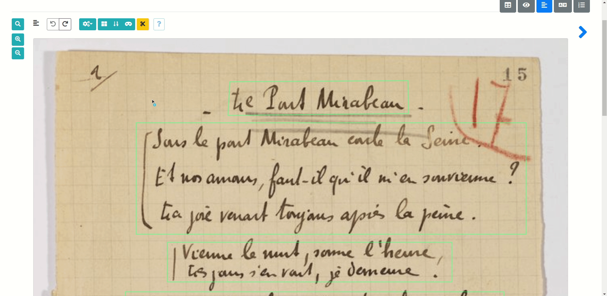
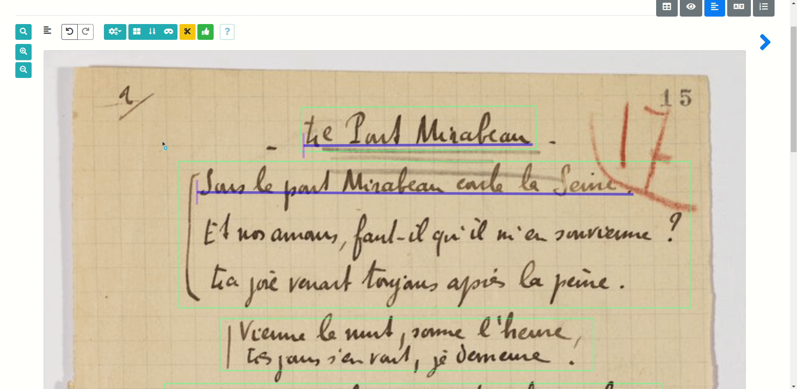
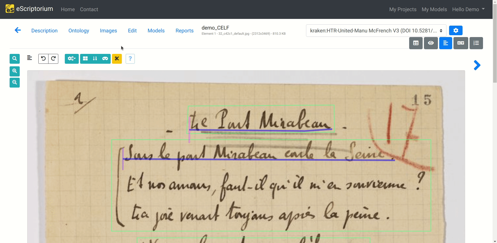
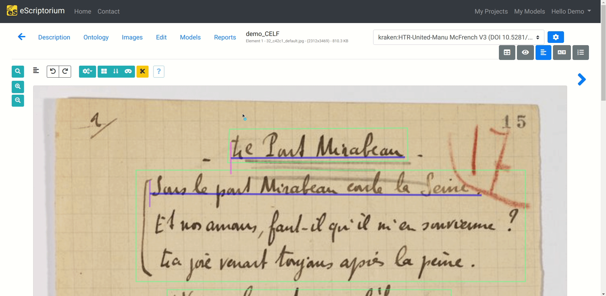
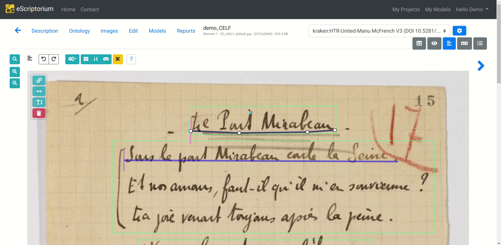

# Segment with eScriptorium

This section introduces the **segmentation panels** and some related features. The segmentation panel is one of the panels available in the "Edit" tab, once you are in a document (`{base_url}/document/{document-id}/images/`).

The segmentation panel is toggled by clicking on the "Segmentation" button at the top of the page (or by pressing ++control+3++).

Segmentation, also called zoning, layout analysis, document analysis, or even optical layout analysis, refers to two processes:

- Extracting and labeling the structure of a document, such as text, images, tables, columns, headings, footers, etc. The goal is to segment the document into meaningful regions, or bounding boxes, that can be further processes or analyzed. This step is optional for transcription, but can be important for later post-processing in an editorial or archiving context.

- Precisely detecting lines of text in an image, which is mandatory in eScriptorium for transcribing said lines later.

Segmentation can result from a prediction, can be performed manually, or can be imported with the **import** button when you import an XML file directly from the **Images** tab inside a document.

!!! warning
    Please make sure to segment your document before transcribing, otherwise, you will risk erasing your transcribed data.

## Text regions segmentation

In the following example, we segmented and labeled the zones that bear a semantic role for our comprehension of the text. We are dealing with a poem, so we drew with eScriptorium bounding boxes around the page number (in blue), the title (in purple), and the stanzas (in green).

However, you could have decided to annotate the layout more precisely, for example, all the verses inside the stanzas. It is up to you to decide how deep you want to go into the text regions segmentation, depending on your needs.

### Segmenting text regions with eScriptorium 

You can draw manually draw bounding boxes inside the Segmentation panel. To do so, switch from baseline editing mode to region mode, by clicking the **mosaic** button, or by pressing ++r++.

You can now draw bounding boxes around the text regions you want to annotate by clicking and dragging a zone (green by default).

You can modify a text region by clicking on it, and by dragging it to the dimensions you want.

You can delete a text region by clicking on it, still in region mode, and by clicking on the delete button, or by pressing ++delete++.

!!! note
    Keep in mind that you can always press ++ctrl+z++ to undo any modification.

### Labeling segmented text regions with an ontology

eScriptorium allows to label segmented text regions with an ontology that you can customize.

The ontology panel is one of the tabs you can access once you are working in a document. It is accessible with (`{base_url}/document/{document-id}/ontology/`). Text regions have a dedicated field named *region types*.

eScriptorium uses four region types by default:

- Commentary

- Illustration

- Main

- Title

You can use them, or create your own. To deactivate default region types, you can deactivate them by unticking the ones you want to discard, and then by clicking on the update button.

You can then create your own by writing the text region name you want into the dedicated field and then the + button. Don't forget to click on the update button to save your modifications!

Then, once you are back to the segmentation panel, you can add a label to the bounding boxes you drew earlier by clicking on them, still in region mode, and then by clicking on the 'Set the type on all selected lines/regions' button, or by pressing ++t++. A dropdown menu should appear with the custom labels you created.

!!! tip
    You can change the color of a text region in eScriptorium in the **images** tab by clicking on **editor settings**. 

!!! note
    It is possible to create nested text regions, just draw another bounding box on top of the text regions you want to annotate!

!!! note
    It is possible to automatically perform [text regions segmentation](predict.md#predict-the-segmentation) with a machine learning model.

## Text lines segmentation

Text lines segmentation is a mandatory process in eScriptorium in order to transcribe a text. In eScriptorium, text lines are composed with two elements:

- a **baseline**, or a **topline** (here in red), which is a virtual line passing through at least two coordinate points. It is on this line that the text is written, or from which it is hanging.

- a **mask** (here in purple), which is a polygon defined by at least three coordinates points. It delimits the area of pixels containing the text of the baseline or topline, and is calculated automatically by eScriptorium based on its coordinates.

### Segmenting text lines with eScriptorium

When segmenting text lines with eScriptorium, you will generally want to draw baseline. If you are in text region mode, the **mosaic** button should be in green meaning it is activate. Unclick it, or just press ++r++. The text regions should now just be the outlines of the different bounding boxes.

To segment text lines, you can:

- Click and drag to underline a line of text. It is similar to a freehand drawing mode. It is generally not recommended, unless you have a specific use case.

- We recommend to segment text lines by clicking on the beginning of your text lines, and then clicking where you want your text line to end. The text line will be straight.

The mask of the segmented text line is then automatically calculated by eScriptorium by clicking on the **thumbs up** button. You can display three views of the baselines with the **toggle line masks and stroke width** button, or by pressing ++m++. One of them will let the mask appear.

eScriptorium also calculate the mask associated with each line asynchronously, you do not need to always press the dedicated button.

You can delete a baseline by selecting it, and by clicking on the thrash button, or by pressing ++delete++.

You can change the reading order of a baseline by selecting it, and then clicking on the **reverse selected lines** button or by pressing ++i++.

!!! tip
    You can select several text lines by pressing ++shift++ and by click and drag around them.

!!! note
    Keep in mind that you can always press ++ctrl+z++ to undo any modification.

### Labeling segmented text lines with an ontology

eScriptorium allows to label segmented text lines with an ontology that you can customize. **This process is exactly the same as the one we described earlier for text regions.**

The ontology panel is one of the tabs you can access once you are working in a document. It is accessible with (`{base_url}/document/{document-id}/ontology/`). Text lines have a dedicated field named *line types*.

eScriptorium uses four line types by default:

- Correction
- Main
- Numbering
- Signature

You can use them, or create your own. To deactivate default line types, you can deactivate them by unticking the ones you want to discard, and then by clicking on the update button.

You can then create your own by writing the text region name you want into the dedicated field and then the **+** button, and then save your modifications with the **upload** button.

Then, once you are back to the segmentation panel, you can add a label to the text line you drew earlier by clicking on them and then by clicking on the 'Set the type on all selected lines/regions' button, or by pressing ++t++. A dropdown menu should appear with the custom labels you created.

!!! warning
    If you created text regions to annotate text lines, you will usually want your text lines to be linked to them. To do so, select your baselines, and click on the **link selected lines to the background region**, or press ++y++. If you want to unlink them, just press the button again, or press ++u++.

!!! note
    It is possible to automatically perform [text lines segmentation](predict.md#predict-the-segmentation) with a machine learning model. 

### Reordering text lines

The reading order of the text lines is calculated automatically. You can display the order number of each text lines from the “Segmentation” panel by clicking on the **Toggle ordering display** button or by pressing ++l++.

You can also go to the “Text” panel (also accessible with the shortcut ++ctrl+5++) where the lines are displayed in the reading order.

In this panel, and after the text lines are transcribed, it is possible to modify the reading order by clicking “Toggle sorting mode.” A simple drag and drop is enough to carry out the modifications.

!!! warning
    Please make sure the quality of the segmentation is good enough before changing the order of the lines because adding or deleting lines restarts the line ordering, overwriting manual modifications in the process.

### Advanced text lines segmentation features

- You can add coordinate points on a text line by double-clicking  at the desired location on the baseline.

- You can move a coordinate point with a simple click and drag.

- You can delete a coordinate point on a baseline by clicking on it, then click on the thrash button or press ++ctrl+delete++.

- You can cut one or several text lines using the scissors tool (++c++).

.")

!!! tip
    All advanced features are described in a help window, just click on **?** in the segmentation panel.
