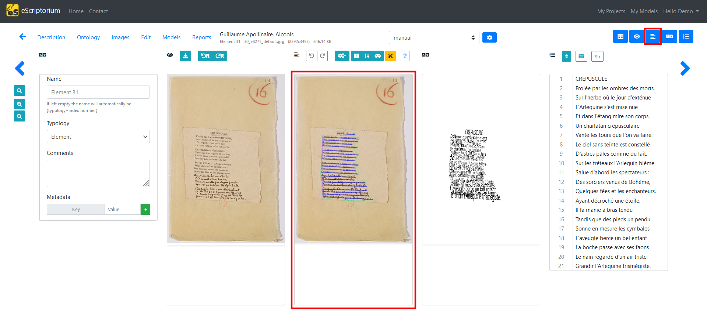
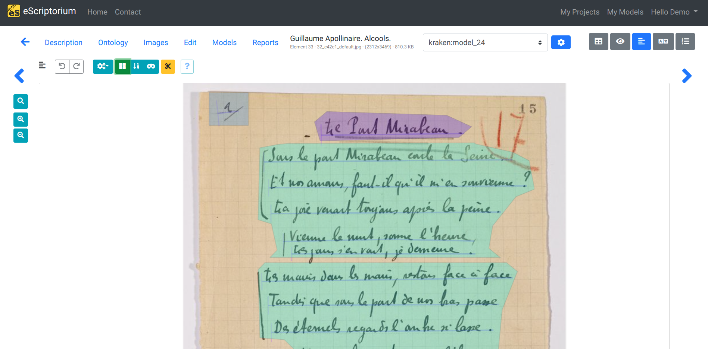
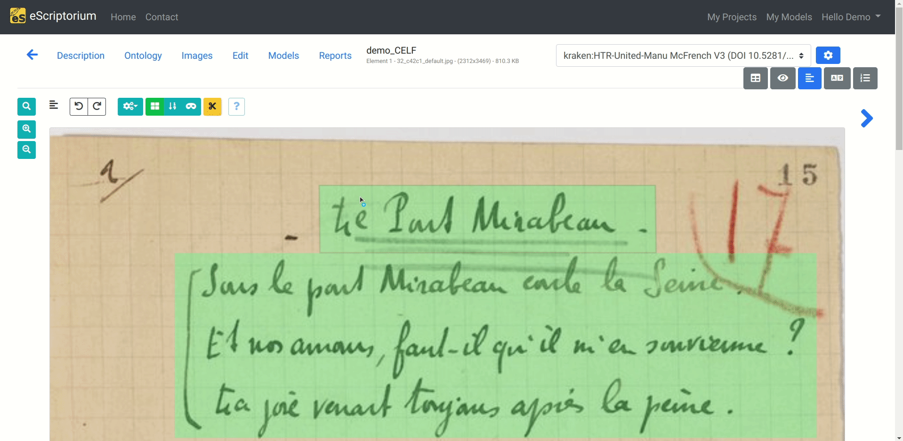
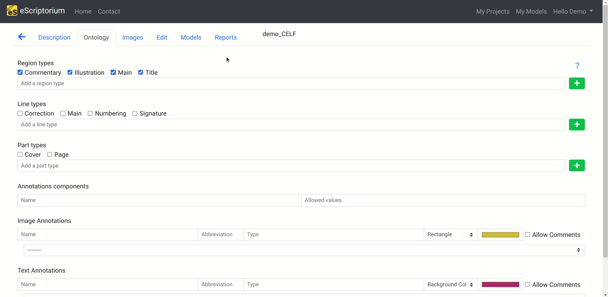
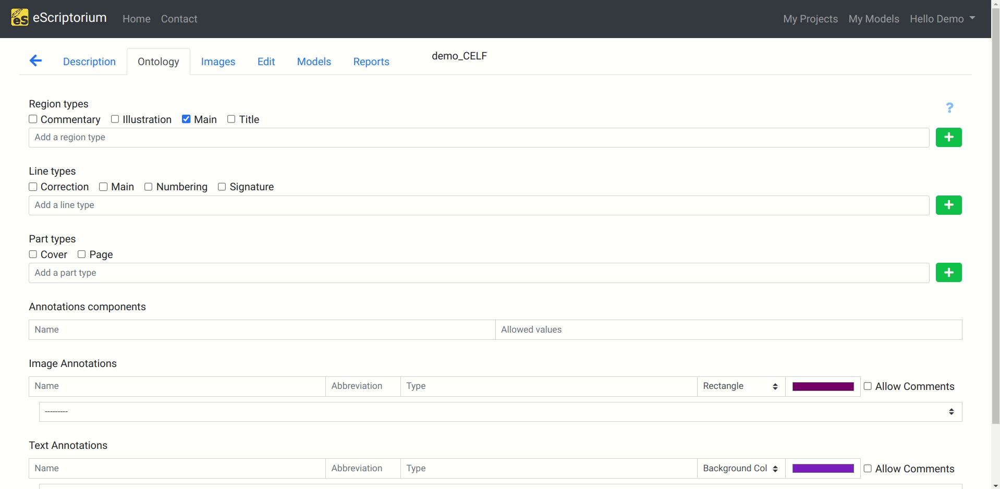
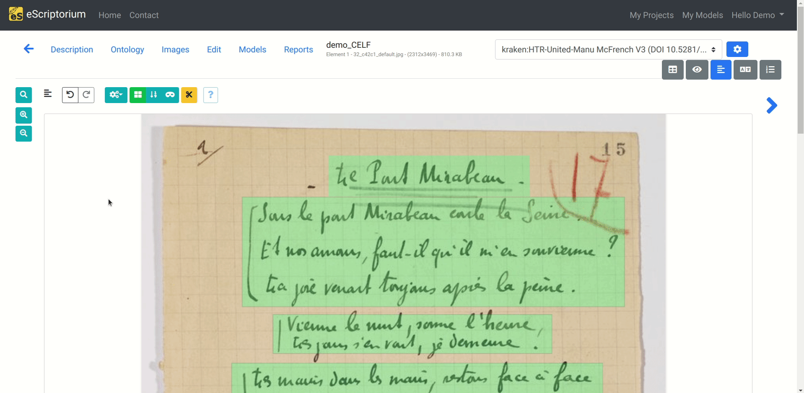

# Segment with eScriptorium

This section mainly introduces the **segmentation panels** and some related features. The segmentation panel is one of the panels available in the "Edit" page, inside a the dashboard of a document (`{base_url}/document/{document-id}/images/`), which is available:

- by clicking on the "Edit" button once you are in your document dashboard (it will send you to the last edited page of the document),
- or by clicking on the "Edit" button of a page thumbnail, in the Images tab.

The segmentation panel is toggled by clicking on the "Segmentation" button at the top of the page (or by pressing ++control+3++).

<!-- todo:

This section should provide solid definition of the elements involved in segmentation (masks/polygons, baselines/toplines, zones, reading order, reading direction, type for region and lines, line ordering (partially covered in transcribe).)

It should also make sure that the importance of when segmentation is done is understood (risk of erasing data if done after a round of transcription), and mention the fact that segmentation can result from prediction, manual segmentation or import.

-->

Segmentation, also called zoning, layout analysis, document analysis, or even optical layout analysis, refers to two processes:

- Extracting and labeling the structure of a document, such as text, images, tables, columns, headings, footers, etc. The goal is to segment the document into meaningful regions, or bounding boxes, that can be further processes or analyzed. This step is optional for transcription, but can be important for later post-processing in an editorial or archiving context.

- Precisely detecting lines of text in an image, which is mandatory in eScriptorium for transcribing said lines later.

## Text regions segmentation

In the following example, we segmented and labeled the zones that bear a semantic role for our comprehension of the text. We are dealing with a poem, so we drew with eScriptorium bounding boxes around the page number (in blue), the title (in purple), and the stanzas (in green).

However, you could have decided to annotate the layout more precisely, for example, all the verses inside the stanzas. It is up to you to decide how deep you want to go into the text regions segmentation, depending on your needs.

### Segmenting text regions with eScriptorium 

You can draw manually draw bounding boxes inside the Segmentation panel. To do so, switch from baseline editing mode to region mode, by clicking the mosaic button, or by pressing ++r++. 

You can now draw bounding boxes around the text regions you want to annotate by clicking and dragging a zone (green by default).

You can modify a text region by clicking on it, and by dragging it to the dimensions you want.

You can delete a text region by clicking on it, still in region mode, and by clicking on the delete button, or by pressing ++delete++.

### Labeling segmented text regions with an ontology

eScriptorium allows to label segmented text regions with an ontology that you can customize. 

The ontology panel is one of the tabs you can access once you are working in a document. It is accessible with (`{base_url}/document/{document-id}/ontology/`).

eScriptorium uses four region types by default:
- Commentary
- Illustration
- Main
- Title

You can use them, or create your own. To deactivate default text regions, you can deactivate them by unticking the ones you want to discard, and then by clicking on the update button.

You can then create your own by writing the text region name you want into the dedicated field and then the + button. Don't forget to click on the update button to save your modifications!

Then, once you are back to the segmentation panel, you can add a label to the bounding boxes you drew earlier by clicking on them, still in region mode, and then by clicking on the 'Set the type on all selected lines/regions' button, or by pressing ++t++. A dropdown menu should appear with the custom labels we created.

Segmentation consists in locating lines of text on the image and identifying the layout. Segmentation includes drawing **baselines** <!-- todo: add a definition -->, **polygones** (or masks) <!-- todo: add a definition --> and **regions** (or zones)<!--todo: add a definition -->. Such 

It is possible to perform [segmentation automatically](predict.md#predict-the-segmentation) or manually. This section covers how to create segmentation information from scratch as well as how to modify an existing segmentation.

## eScriptorium segmentation panel features

<!-- rewrite this section-->

The Segmentation panel has several features:

- Drawing baselines corresponding to the locations of the text on the image in two ways:
    - Point by point plot;
    - Free route (not recommended).
- Adding points on a line (select it then double-click at the point’s location);
- Moving one or more point(s) by a simple select-drag;
- Deleting one or more point(s) on a line;
- Cutting one or more lines using the scissors tool;
- Joining one or more lines;
- Configuring the reading direction of a line;
- Activating the calculation of the polygons associated with each line (this task is automatic and managed asynchronously without any action on the part of the user after the first use).

In this panel, it is also possible to create regions (or zones ) and associate segments to them. Note that a segment located within the perimeter of a region is not always automatically associated to it.

All the operations that can be carried out in this panel are detailed in a help window (to display it, click on “?”). It will thus be noted that there are many shortcuts making it possible to simplify all these operations.

!!! Note
    The following is a copy of the content of the contextual window appearing when clicking on "?".

- ++left-button++ on the image to create new line, ++right-button++ to **add points** and ++left-button++ again to finish it.
- You can keep the mouse button pressed for free drawing.
- Hitting ++escape++ while drawing a line cancels it.
- If regions matter to you switch to region mode first (++r++).
- when in region mode ++left-button++ to create a new rectangular region, left click again to finish it.
- lines drawn inside a region will automatically be bound to it.
- When the quality of the segmentation is good, you can prompt the system to calculate masks ,
- once a page already has masks new lines will automatically get a mask and - updating a line will also recalculate its mask.
- **Note** that the quality of the masks is highly dependent on the quality of the whole segmentation, not only the corresponding line,
- so make sure to draw all the lines before calculating the masks.
- You can also have the option to calculate the masks en masse in the Images tab -> segment -> choose 'Only masks'.

- ++left-button++ on a line to select it, then you can drag its closest control point.
- **Double click** on the line will create a new control point at the mouse location.
- You can reverse the order of the line's points by selecting a line (or multiple) and using reverse (++i++).
- When in region mode, Regions can be edited the same way.
Selected lines can be linked or unlinked to regions with the corresponding buttons (++y++) (++u++).
- By using the cut mode (++c++) you can cut through lines, splitting them in two or removing part of them.
- If at least two lines are selected a option to join them becomes available (++j++).
You can go through your changes history back and forth with ++ctrl+z++ (undo) and ++ctrl+Y++ (redo) or by using the corresponding buttons .

- ++shift+left-button++ allows to add or remove a line from the selection,
- Clicking on an empty space clears the selection,
- ++shift++ and drag creates a lasso selection tool that allows to select control points (they then appear black).

- **Note:** If lines are already selected the lasso will only select points in those lines.

- ++ctrl++ and drag allows to move all the selected control points at once (or the selected lines if no control points are selected).

- The red trash button deletes all selected lines/regions,
- The yellow trash button only deletes selected control points.

<!--## Editing lines

## Editing regions -->

## Reordering

The playback order of the segments is calculated automatically. You can display the order number of each segment from the “Segmentation” panel by clicking on “Toggle ordering display (L)” or from the “Text” panel where the lines are displayed in the following order.

It is possible to modify this order from the “Text” panel by clicking “Toggle sorting mode.” A simple drag and drop of the lines is then enough to carry out the modification.

!!! warning
    It is advisable to ensure the quality of the segmentation before changing the order of the lines because adding or deleting lines systematically restarts the calculation of this order, overwriting manual modifications in the process.