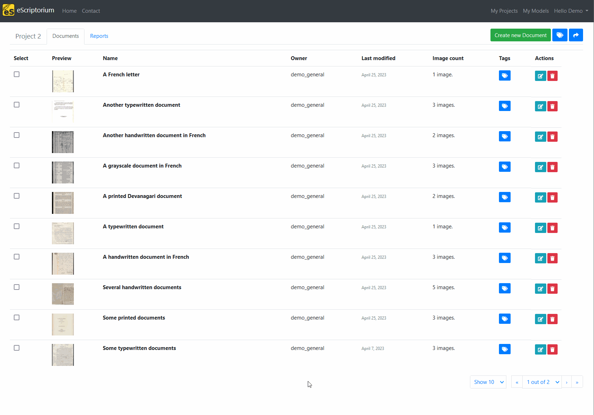
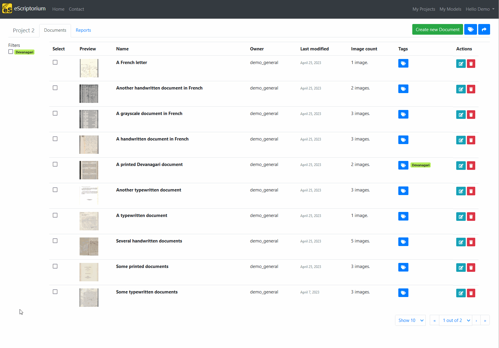
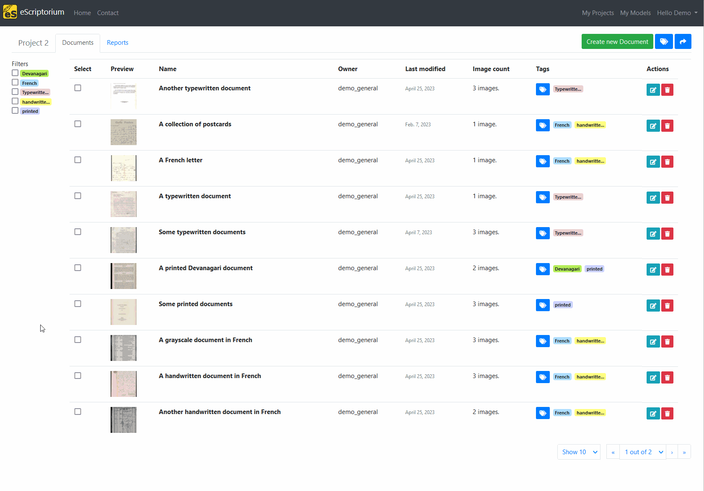
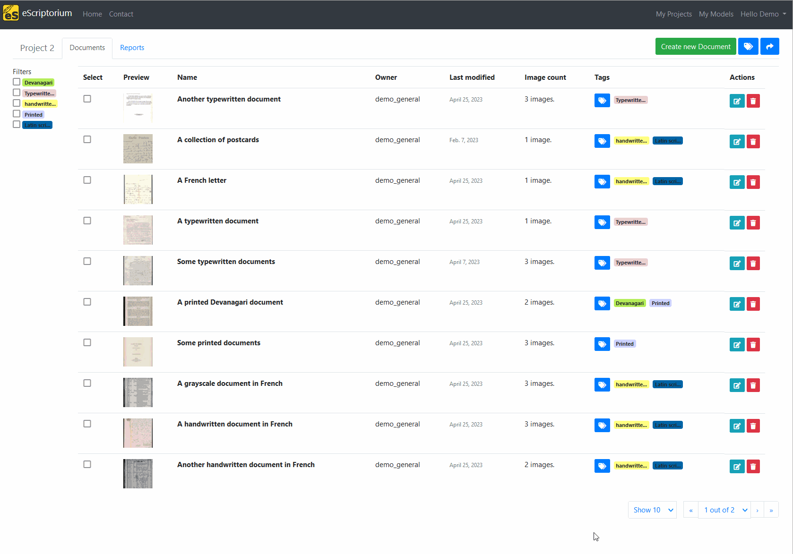

# Tags on documents

Tags are a useful feature to manage a project and its documents: they allow you to index your documents according to different criteria such as the state of completeness of the transcription task, the type of font, script or language used in them, or any other information you may require. Indeed, when you apply a tag to a document in a project, it becomes possible to filter the documents displayed in the dashboard according to the assigned tags. The following section describes how to use and manage the tags inside your project.

Since you are free to set the labels you want, it is difficult to illustrate all the possible usage of such feature. Here are some examples:

- tagging the script or language used in a document when the project combines several languages, it allows you to filter by language or script;
- tagging the state of a document (for example "to segment", "segmented", "to transcribe", "to review", etc.);
- tagging the team or people in charge of annotating/reviewing a document, it allows them to easily retrieve the document they have to work on;
- tagging a bugged document to later resolution;
- tagging the state of publication of a document composing a dataset;
- tagging the quality of a document's transcription (ex: "ground truth", "gold", "silver", etc)

Creating, assigning, un-assigning and removing tags is done on a project dashboard. From "My projects", simply click on a project's name to access the project's dashboard (equivalent to `{base_url}/project/{project-slug}/documents/`).

## Add a tag to a document

By default, your project doesn't contain any tag. There are two ways to create and assign new tags: to one document at a time, or to several documents at a time.

To create and assign a tag to a document, click on the "Assign Tags" button in the "Tags" column. A pop-up will appear where you can type the name of a tag and, optionally, change its color. Click on "Save" to save the change. If you are creating a tag for the first time, you might need to refresh the page.

To create and assign a tag to several documents at a time, select the documents by checking the boxes on the first column and then click on the "Manage tags" button. It will open a pop-up where you can type the name of a tag to create it. As soon as you click outside of the field, the tag is created. You can change the color before starting to type, or after its creation.

## Filter documents using tags

Tags allow you to have, at once, hints about the state of the documents in your project. It is also very useful to sort your documents thanks to the filter feature.

To filter documents, check the box next to a tag label in the side panel. You can select multiple tags at once, but be aware that only tags with all the selected tags will be retrieved. For example, if you check "French" and "Handwritten" and "To review", it is equivalent to filter with `French AND Handwritten AND To review`, it will not be equivalent to `French OR Handwritten OR To review`. At the moment, it is not possible to modify the operator.

## Change a tag's color or name

When the "Manage Tags" or the "Assign Tags" windows are open, a color is randomly chosen for the future tag. You can change it while you are creating the tag, or after its creation.

A tag's color can be changed in the "Manage Tags" module. This is particularly useful if you find that the contrast between the black text and the color of the tag is not sufficient to ensure its readability. Click on "Manage Tags": the module will show the list of all the tags available for the project. You can edit the text of a label by changing the text in the input field, or change its color by clicking on the colored rectangle next to the label. Clicking outside of the input field will automatically save the change.

## Assign or a unassign a tag

To unassign a tag from a document, click on "Assign Tags" in the document's row. Then, use the select menu to uncheck the tags to assign one or several an existing tag or unassign tags. The modification will only affect the current document.

## Delete a tag

When a tag is not assigned to any document, it is still available for future assignments. If you want to permanently delete a tag, you can do it in the "Manage Tags" module. You simply need to click on the "trashcan" button, next to the tag. Upon deletion, the tag is automatically unassigned from all the documents it was assigned to.

")