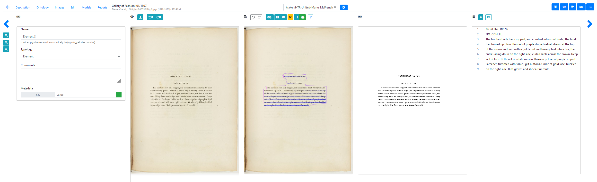

# Terminology

## Projects, documents and document-parts

In eScriptorium, the data is organized inside **projects** which contain **documents**, which in turn contain **document-parts**.

- A *document-part* is simply an image (a digitization) of a document: it can be the photography of a double page, a single page, or even cropped portion of such images. Sometimes it is called an "Element".  
- A *document* is a collection of such images, similar to how you would organize a directory containing images on your file system.
- *Projects* can be understood as one more level to gather documents (themselves groups of images), but they can be envisioned as workspaces for a group of users working for the same project. For example, [tags](tags.md) are managed at project level, available for all the documents inside the given project.

## Edition panels

The edition panels refer to the panels (5) available in the edition page. This page is accessed via the following URL: `{base_url}/document/{doc_id}/part/{part_id}/edit/` (where `base_url` is the URL of the server where the application is deployed, `doc_id` the id of your document, and `part_id` the id of the document part being edited).

There are multiples wats to access the edition page, for example:

- from the document dashboard, by clicking on `Edit last updated Element`,
- from a document's Images page, by clicking on the "Edit" button on one of the thumbnails.

There are 5 panels:

1. **Metadata** (++control+1++), used for:
    - changing a document part's metadata <!-- todo: add link if we ever make a documentation somewhere -->

2. **Source Image** (++control+2++), used for:
    - drawing [annotations](annotate.md#draw-an-annotation-on-an-image)
    - rotating an image <!-- todo: add link if we ever make a documentation somewhere -->

3. **Segmentation** (++control+3++), used for:
    - the [segmentation features](segment.md)
    - viewing the order of the lines <!-- todo: add link if we ever detail -->
    <!--only in the most recent versions: - deactivating dynamic line ordering-->

4. **Transcription** (++control+4++), used for:
    - [some of the transcription features](transcribe.md#editing-with-the-transcription-panel)

5. **Text** (++control+5++), used for:
    - [other transcription features](transcribe.md#editing-with-the-text-panel)
    - adding [textual annotations](annotate.md#text-annotations)
    - changing the [order of the lines](segment.md#reordering)

!!! Tip
    You can toggle as many panel as you want at once. It is not advised to have all of them active at the same time, though, because it limits the readability of the documents and you may unintentionally call some shortcuts.

<!--
## Do you speak training?

todo 

-->