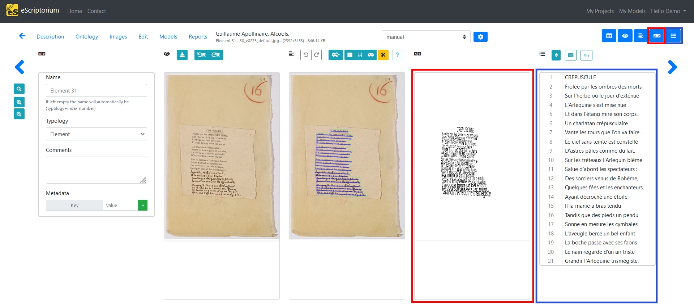
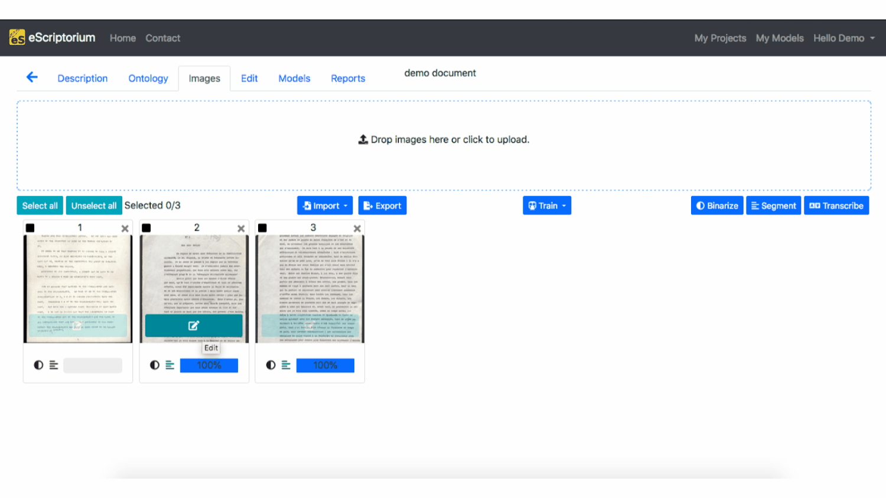
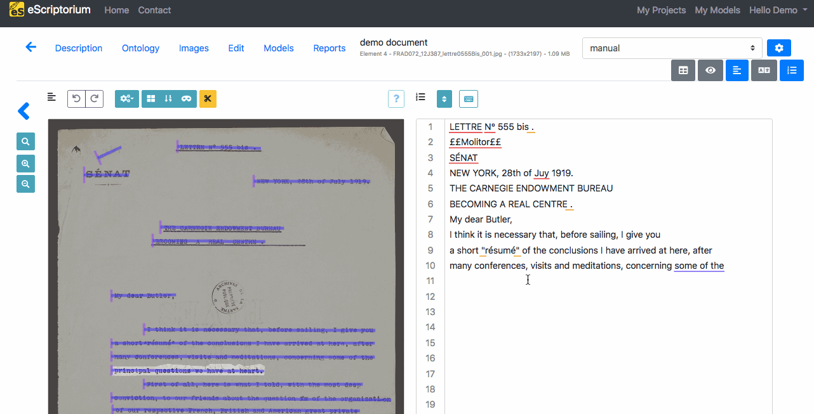
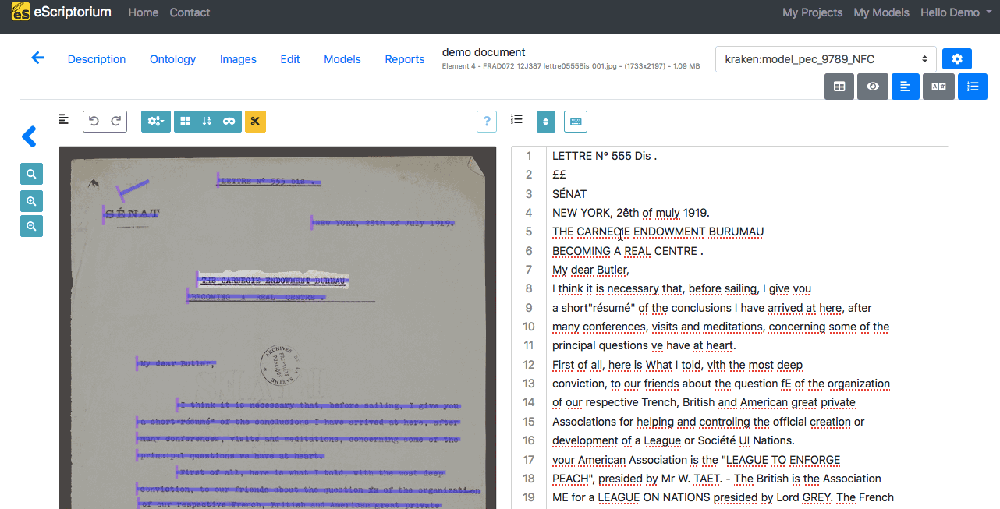
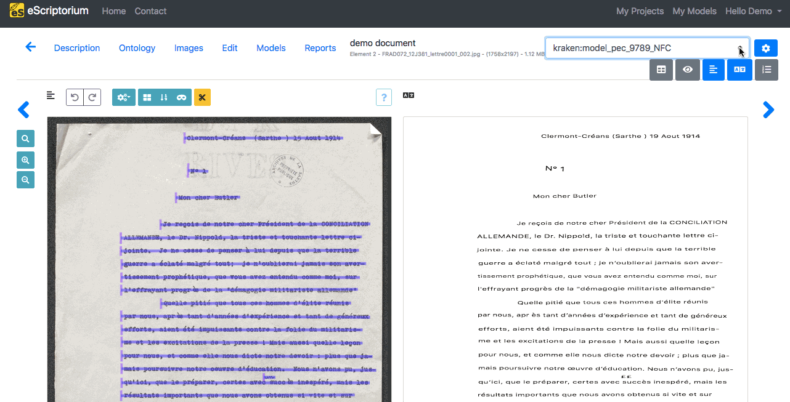
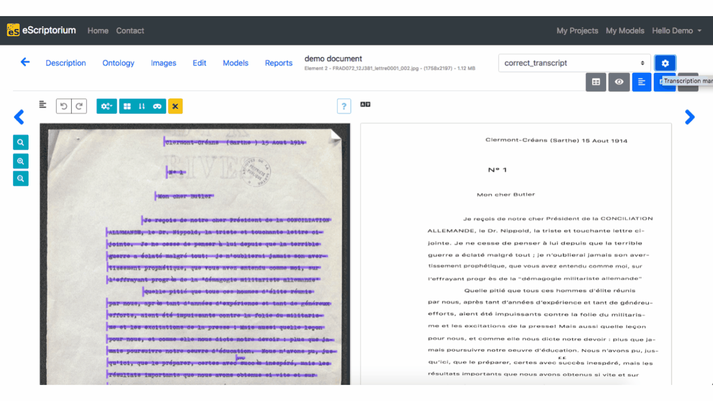
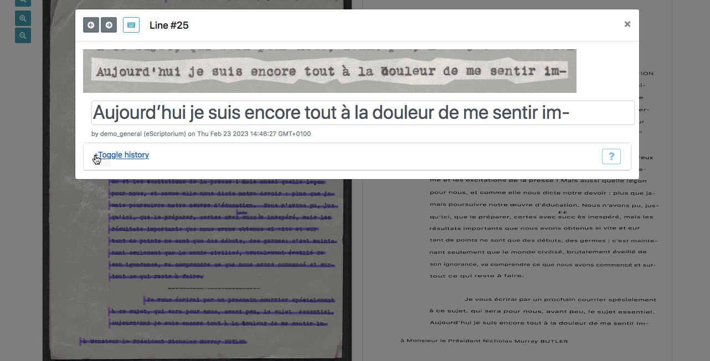
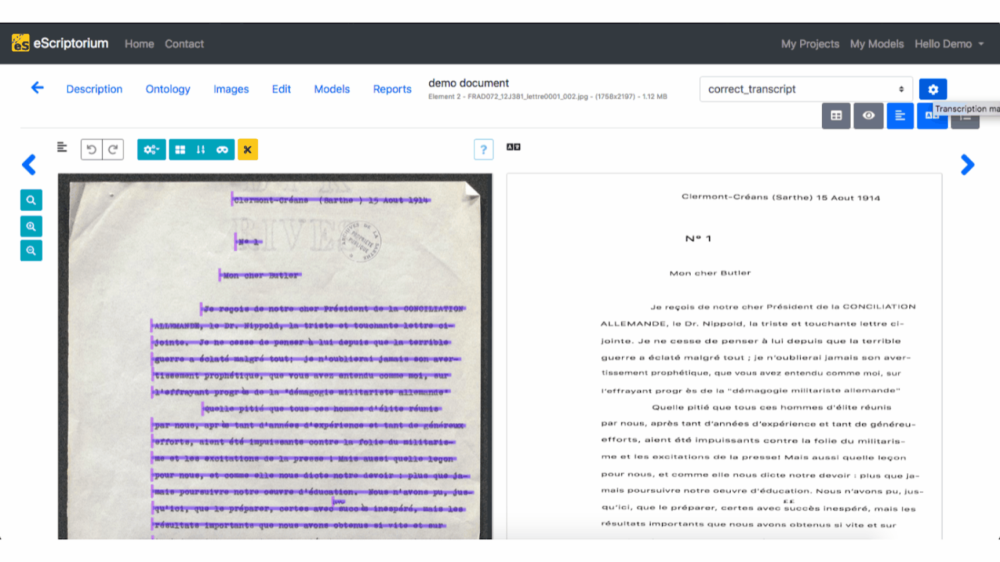

# Manual transcription in eScriptorium

!!! Note
    For more information on automatic transcription, see the [prediction](predict.md#predict-the-segmentation) section.

Transcription is a step that comes after [manually](segment.md) or [automatically segmenting](predict.md#predict-the-segmentation) the image. Make sure to review these pages first if necessary.

Manual transcription is usually necessary to produce training materials or when reviewing the result of an automatic transcription. The following section introduces the two panels dedicated to creating or modifying the transcription, as well as some related features.

## Where to find the transcription features

To work on the transcription manually, you need to be on the "Edit" tab of a document dashboard (`{base_url}/document/{document-id}/images/`), which is available:

- by clicking on the "Edit" button once you are in your document dashboard (it will send you to the last edited page of the document),
- or by clicking on the "Edit" button of a page thumbnail, in the Images tab

Two panels allow you to manually modify the transcription:

- the 4th panel, called "Transcription" (++control+4++),
- and the 5th panel, called "Text" (++control+5++).

!!! Tip
    If your transcription project requires using special characters, you can set and use a [virtual keyboard](virtual_keyboard.md).

## Editing with the "Transcription" panel

The "Transcription" panel displays the text in a way that imitates the layout of the document.  

")  

To start transcribing, click on the line you want to edit (it will be highlighted in the "Image" panel). An input window will appear where you can type the text corresponding to the line image that is displayed.  

Pressing ++enter++ or ++arrow-down++ will record the text and move to the next line. You can also use ++arrow-up++ to go back to the previous line.

You can also modify an existing transcription. The technique is the same as for the manual transcription: you click on the line, modify what is necessary and then press ++enter++. Each modification will be saved in a [history](#transcription-history) listing the user or model responsible for each of them.

## Editing with the "Text" panel

This panel displays the transcription as a plain succession of text lines, according to the line order visible in the [segmentation](segment.md) panel. Hovering over a line in the "Text" panel will highlight it on the image if the "segmentation" panel is toggled.

")

Transcribing with the text panel is similar to typing in a simple text editor: pressing ++enter++ will make you switch to the next line and you can use ++arrow-up++ and ++arrow-down++ to navigate between the lines.

Clicking outside of the "Text panel" will automatically save your editions: a "Saving" icon will appear above the panel, indicating that it is recording your changes.

You can also modify an existing transcription. The technique is the same as for the manual transcription: you click on the line, modify what is necessary and then press ++enter++.

## Sorting lines

Line ordering is automatically calculated during [segmentation](segment.md).  

When [controlling lines order](segment.md)<!-- todo: add a more precise link to controlling line ordering -->, you may notice that some lines are mixed up. It is possible to manually change the order inside the "Text" panel, by clicking on the "Toggle sorting mode" button, at the top of the panel.  

In Sorting mode, you can select one or several lines at a time before using drag and drop to place them in the rightful place.

## Transcription versions

### Manage transcriptions

A document can be associated simultaneously to several versions of transcription. Each version has its own name.  

- There is always a default version, called "manual",
- Predicting a transcription with a model will create a new transcription version named after the model (ex: kraken:demo_model),
- Importing a transcription from an XML file will create a new transcription version named after the name set during [import](import.md) or the default import name, "Zip Import".

!!! Note
    Currently, you cannot manually create a new transcription version.

!!! Warning
    Contrary to transcription, there can only be one version of segmentation in a document (see [here](segment.md)).

To display the list of available transcription versions, click on the drop-down menu in the top-right corner and choose the version you want to see.

To delete a transcription version, click on the "Transcription management" button (blue button with the gear) in the top-right corner. The "Delete" button will delete the chosen version **irrevocably for ALL the images of the document**.

!!! Danger
    Even when a text recognition model is applied to one of the document's page, the new version will be created at document level. This means that, even if the display is at document-part level, the creation or **deletion** of a transcription version will impact all the images of the document.

## Transcription history

!!! Note
    This is only available in the "Transcription" panel.

It is possible to keep track of the changes made on a transcription line by line. To do so, you can click on one line from the transcription and select "+Toggle history" with which you can see the changes made.

The "Toggle History" option is only visible when a line was modified more than once. You can only see the history of the modifications applied to one [transcription version](#transcription-versions) at a time.

The parts in red indicate the deleted characters, those in green indicate the added characters. A red character followed by a green character usually means that the former character was replaced with the latter.

### Compare transcriptions

!!! Note
    This is only available in the "Transcription" panel.

It is possible to compare several versions of a transcription.  

- First, choose the base version you want, i.e. the one version others will be compared to. To do so, select it as the displayed version in the Transcription panel.  
- Then, click on the "Transcription management" button in the top-right corner. Choose the versions you want to compare by ticking the checkboxes under "Compare".
- Close the pop-up box, by clicking on the cross or simply by clicking somewhere else on the page.  
- Then, select any line in the "Transcription" pane and click on "+Toggle transcription comparison" to see the difference.  

The parts in red indicate the deleted characters, those in green indicate the added characters. A red character followed by a green character usually means that the former character was replaced with the latter.

