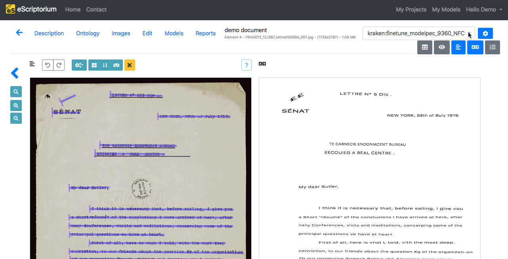

# Walkthrough: transcribe with eScriptorium

Once the [segmentation of the images](segment.md) have been achieved and [some annotations](annotate.md) have been added, if needed, the next step in eScriptorium will be the text recognition of the documents and it is possible to do this step manually or automatically.

## Automatic transcription

<!-- todo: move "obtaining a model" to predict.md -->
### Obtaining a model

You need a model to transcribe automatically, here are some ways to get one:  

- by [training one with eScriptorium](train.md) or (via the command line) with [kraken](https://kraken.re),
- by having one shared with you, either within [eScriptorium](collaborate.md#share-a-model), or sent to you as a file through other means of communication,
- by importing a model from a file. Such files can be retrieved on the [Zenodo community](https://zenodo.org/communities/ocr_models/) dedicated to Kraken models.

### Predicting the transcription

To learn how to apply the text recognition model and obtain a prediction, see ["Predict a segmentation or a transcription"](predict.md).  

## Manual transcription

To work on the transcription manually, you need to be on the "Edit" tab of your document, which is available either by clicking on the "Edit" button once you are in your document or in a square when you hover upon the thumbnail of an image once your are in the following URL: `{base_url}/document/{document-id}/images/`.

Out of the five panels available in eScriptorium, two allow you to create and edit the transcription: "Transcription" and "Text".

!!! Tip
    If you need to have special characters in your transcription and they are not available on your own keyboard, you can set and use a [virtual keyboard](virtual_keyboard.md). 

### The "Transcription" panel

The "Transcription" panel displays the text in a way that imitates the layout of the document.  

")  

To start transcribing, click on the line you want to edit (it will be highlighted in the "Image" panel). An input window is then displayed.  

Pressing ++enter++ or ++arrow-down++ will record the text and display the input field for the next segment. You can also use ++arrow-up++ to go back to the previous segment.  

You can also modify an existing transcription. The technique is the same as for the manual transcription: you click on the line, modify what is necessary and then press ++enter++. Each modification will be saved in a history listing the user or model responsible for each of them.

### The "Text" panel

This panel will display the transcription as a plain succession of text lines, according to the line order from the segmentation. 

")

To start transcribing, click on the line you want to edit (it will be highlighted in the "Image" panel). To record a transcription, press ++enter++ or click outside of the panel: a "Saving" icon will appear above the panel, indicating that it is recording your changes.

You can also modify an existing transcription. The technique is the same as for the manual transcription: you click on the line, modify what is necessary and then press ++enter++.

## Sorting lines

Line ordering is automatically calculated during [segmentation](segment.md).  

When [controlling lines order](segment.md)<!-- todo: add a more precise link to controlling line ordering -->, you may notice that some lines are mixed up. It is possible de manually change the order inside the "Text" panel, by clicking on the "Toggle sorting mode" button, at the top of the panel.  

In Sorting mode, you can select one or several lines at a time before using drag and drop to place them in the rightful place.

## Transcription versions

### Manage transcriptions

A document can be associated simultaneously to several versions of transcription. Each version has its own name.  

- There is always a default version, called "manual",
- Predicting a transcription with a model will create a new transcription version named after the model (ex: kraken:demo_model),
- Importing a transcription from an XML file will create a new transcription version named after the name set during [import](import.md) or the default import name, "Zip Import".

!!! Note
    Currently, you cannot manually create a new transcription version.

!!! Warning
    Segmentation, on the contrary, has only one version (see [here](segment.md)).

To display the list of available transcription versions, click on the drop-down menu in the top-right corner and choose the version you want to see.

To delete a transcription version, click on the "Transcription management" button (blue button with the gear) in the top-right corner. The "Delete" button will delete the chosen version **irrevocably for ALL the images of the document**.

!!! Danger
    Even when a text recognition model is applied to one of the document's page, the new version will be created at document level. This means that, even if the display is at document-part level, the creation or **deletion** of a transcription version will impact all the images of the document.

## Transcription history

!!! Note
    This is only available in the "Transcription" panel.

It is possible to keep track of the changes made on a transcription line by line. To do so, you can click on one line from the transcription and select "+Toggle history" with which you can see the changes made.

The "Toggle History" option is only visible when a line was modified more than once. You can only see the history of the modifications applied to one [transcription version](#transcription-versions) at a time.

The parts in red indicate the deleted characters, those in green indicate the added characters. A red character followed by a green character usually means that the former character was replaced with the latter.

### Compare transcriptions

!!! Note
    This is only available in the "Transcription" panel.

It is possible to compare several versions of a transcription.  

- First, choose the base version you want, i.e. the one version others will be compared to. To do so, select it as the displayed version in the Transcription panel.  
- Then, click on the "Transcription management" button in the top-right corner. Choose the versions you want to compare by ticking the checkboxes under "Compare".
- Close the pop-up box, by clicking on the cross or simply by clicking somewhere else on the page.  
- Then, select any line in the "Transcription" pane and click on "+Toggle transcription comparison" to see the difference.  

The parts in red indicate the deleted characters, those in green indicate the added characters. A red character followed by a green character usually means that the former character was replaced with the latter.

