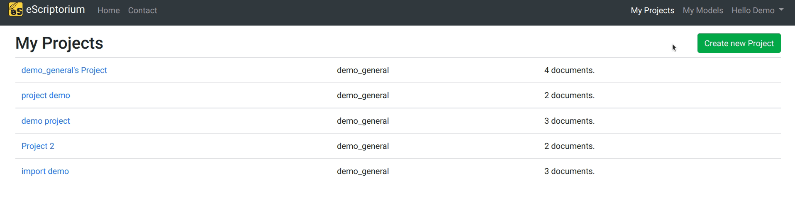
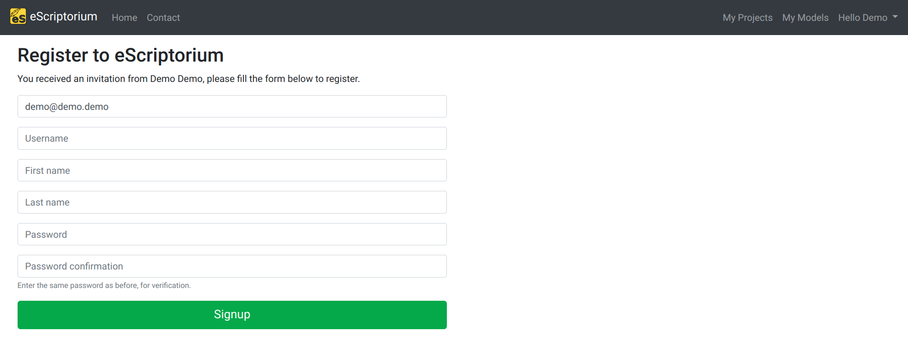

# Walkthrough: collaborate within eScriptorium

This walkthrough is about the features related to collaboration in eScriptorium.
## Teams  

Users can be grouped by Teams. The main purpose of a team is to facilitate [sharing documents or projects](#share-a-project-or-a-document). Teams are also helpful to identify a group of people working on the same project or coming from the same institution.  

It is possible to manage teams from the [Profile page](walkthrough_users.md). Team management includes:  

- Creating a team,  
- Leaving a team,  
- Adding or removing members from a team,  
- Transfering ownership to another member.  

Only the owner of a team is allowed to add or remove members or to transfer ownership. The owner of a team cannot leave it without first transferring the ownership to another user.

??? Note "No deleting, no renaming"
    It is currently impossible to delete a team or to rename a team.

??? Note "One owner per team"
    There can only be one owner at a time.  ## Create a team or join a team

## Invite a user

If you are an administrator or if you have the invite user permission, you can invite anyone to sign-up to a specific instance of eScriptorium by going to the user menu and clicking on "Invite".

Then, you can fill the form with the recipient's information: email, first name, last name, and the team <!-- todo: link to the team section in Collaborate and Users -->the user will join. Only the email form is mandatory.

The recipient will then receive an email with a link to sign-up to the instance.

## Share a project or a document

You can share projects and documents to others users of your eScriptorium instance, and you can also share documents to members of the team you are a part of.

!!! Note
    By default, 

## Share a model
