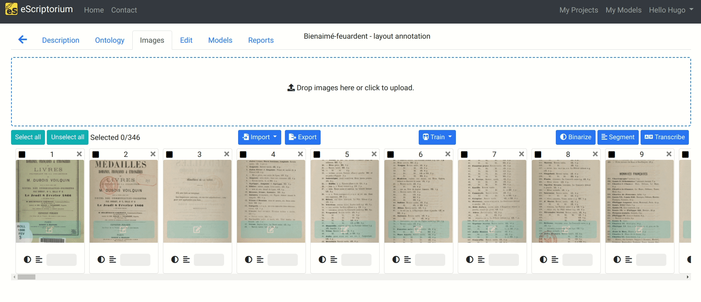
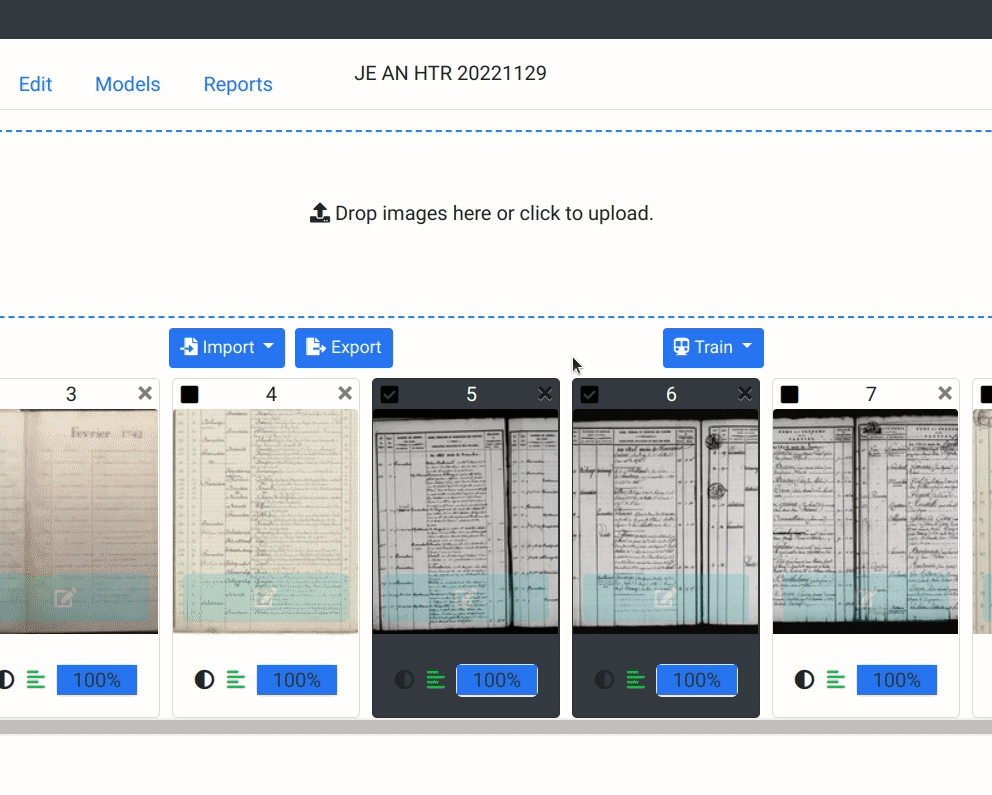
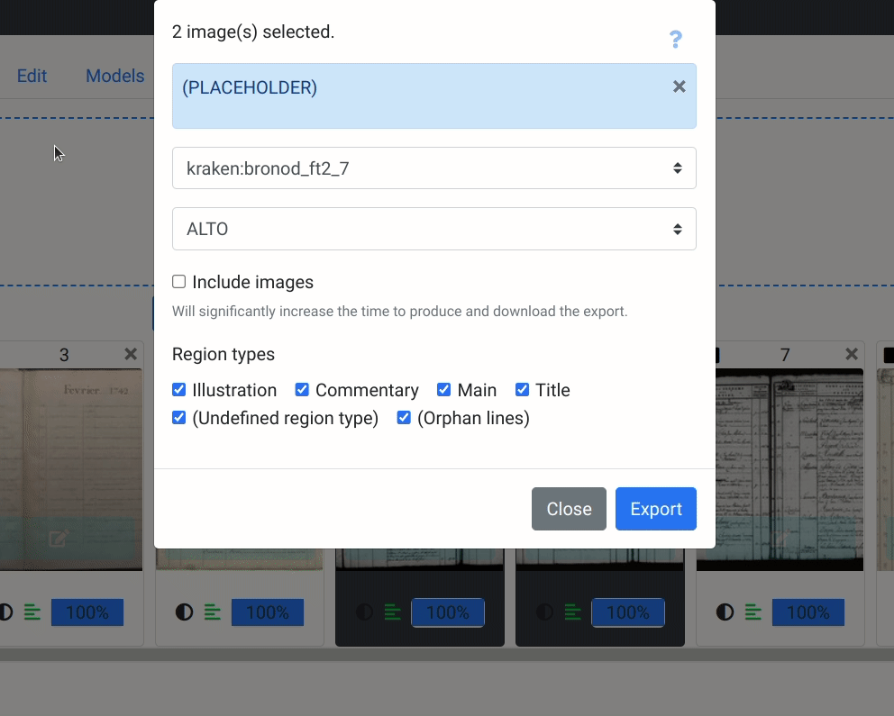
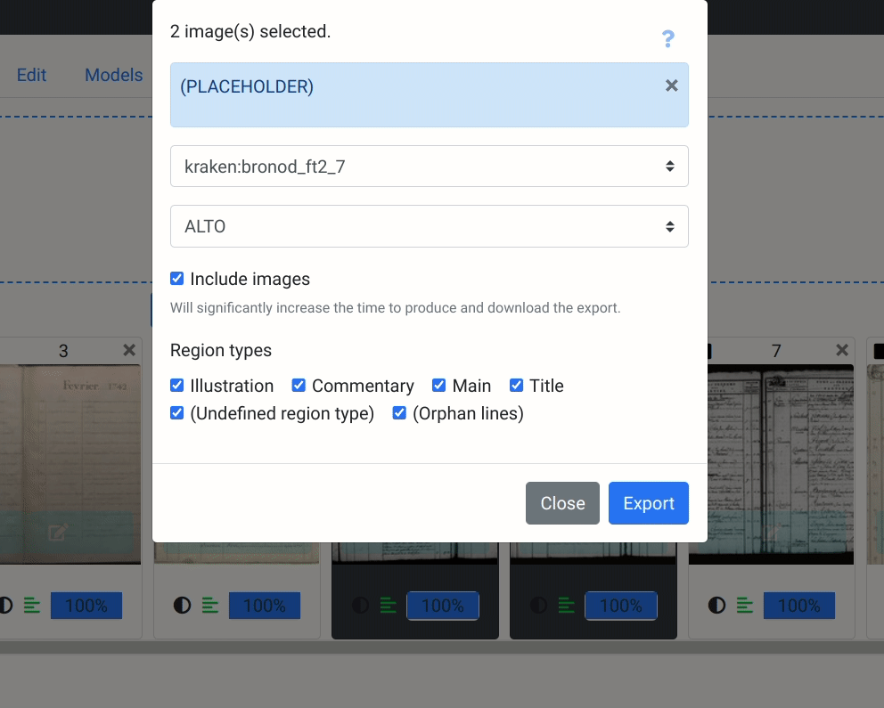
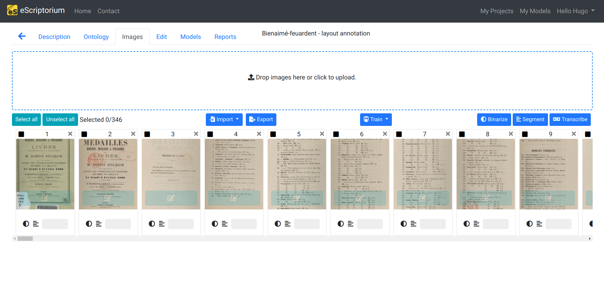

# Walkthrough : Export from eScriptorium

## Exporting models

## Exporting annotations

eScriptorium allows users to export annotations, with or without images, to three different [output formats](#selecting-the-output-format).  

The exporting feature is located in the "images" tab (also accessible at `{base_url}/document/{document-id}/images/`), inside an eScriptorium document.  

Select the relevant document-parts by ticking their checkboxes, then click on the "Export" button, next to the "Import" button. A pop-up box then appears. It allows to set four parameters for the export.

!!! Tip
    You can select multiple documents at once by pressing the ++shift++ key.

### Selecting the version of the transcription to export

In the first drop-down menu, you can select which transcription version is to be exported.  

!!! Note

    * Manual annotations are registered as the __manual__ version.
    * Imported annotations, when batch imported with a zip file, are registered as the __Zip import__ version. <!-- todo: add link to import -->
    * Annotations predicted with a transcription model are named with the model's name. <!-- todo: add link to predict transcription -->

### Selecting the output format

In the second drop-down menu, you can select between three output formats:

* Text for plain text  
* PAGE for [PAGE XML](http://www.primaresearch.org/publications/ICPR2010_Pletschacher_PAGE)
* ALTO for [XML ALTO](https://www.loc.gov/standards/alto/) (Analyzed Layout and Text Object)

### Including (or not) images linked to the annotations

You can include the images corresponding to the selected document-parts by ticking the "Include images" checkbox.

As mentioned in the export pop-up box, and depending on the images' sizes, including image in the export can significantly increase the time to produce and download the export.

### Selecting the region types to export

You can include or exclude lines or whole regions and their associated lines with the last parameters. <!-- todo: add link to the subsection about segment version -->

To do so, tick the checkboxes associated to the region types you want to export or uncheck the ones you want to ignore.  

!!! Note
    By default, there are __six region types__ available to export : Illustration, Commentary, Main, Title, (Undefined region type), (Orphan lines). (Undefined region type) are regions without a name. (Orphan lines) are lines not linked to any region. Make sure to always tick the checkbox for (Orphan lines) to avoid loosing any not-linked annotation.

You can export a region type even though no annotations are linked to it. It will be mentioned in the resulting exported file, but no annotations will be linked to it.  

!!! Note
    Region types' name will only appear when exporting in ALTO and PAGE. When exporting as plain text, only the annotations will be exported.

### Downloading the export

Once all options are set, click on the "Export" button at the bottom of the pop-up. 

Once the export is ready, a green message box will appear in the upper-right section of the interface, providing you with a download link. Click on "Download" to download the txt file or the zip file resulting from your export.

When exporting ALTO and PAGE, the exported file is saved as a zip file containg an XML file per document-part, the corresponding images if included, as well as a METS XML file describing the ensemble.

When exporting plain text, clicking on "Download" will redirect you to a new URL, displaying the plain text. All the transcriptions are concatenated as a single text file.

!!! Tip
    If you plan on doing several exports, we recommand to close the green message-box after each export (after downloading the file).  

### Finding previous exports

Each export is provided a unique permanent link. You can save it, for example to automatically re-download it later without having to set the whole export again but it is also possible to find the links to all your previous exports in the Profile page, under the "Files" tab.<!-- todo: add link to "review and edit your profile" which should logically be : [Profile page, under the "Files" tab](walkthrough_users.md#review-and-edit-your-profile)-->