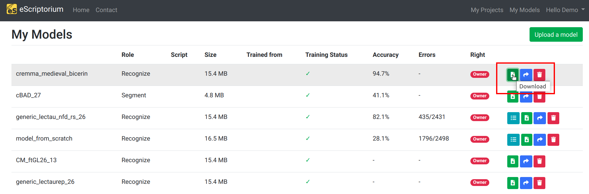

# Walkthrough : Export from eScriptorium

## Exporting transcription and segmenting models

eScriptorium allows users to export models that were previously imported, or models they trained. 

To do so, go to the "My Models" page, accessible via the navigation bar, in the upper right section of the interface, or via `{base_url}/models/`.

All models linked to a specific account are listed there with their metadata.

You can export a model the download green button, after all metadata on the right. It will then download a file with the `.mlmodel` extension.

## Export annotations

eScriptorium allows users to export annotations (segmentation and transcription), with or without images, to three different [output formats](#selecting-the-output-format).  

The exporting feature is located in the "images" tab (also accessible at `{base_url}/document/{document-id}/images/`), inside an eScriptorium document.  

Select the relevant document-parts by ticking their checkboxes, then click on the "Export" button, next to the "Import" button. A pop-up box then appears. It allows to set four parameters for the export.

!!! Tip
    You can select multiple documents at once by pressing the ++shift++ key.

### Select the transcription version

In the first drop-down menu, you can select which transcription version is to be exported.  

!!! Note
    * Manual transcriptions are registered as the __manual__ version.
    * Imported transcriptions, when batch imported with a zip file, are registered as the __Zip import__ version. <!-- todo: add link to import -->
    * Transcriptions predicted with a model are named with the model. <!-- todo: add link to predict transcription -->

!!! Note  
    When a document-part does not contain any segmentation, an XML file will still be created.  

!!! Note  
    When a document part does not contain any transcription in the selected transcription version, an XML file will still be created, containing only segmentation information.  

### Select the output format

In the second drop-down menu, you can select between three output formats:

* Text for plain text  
* PAGE for [PAGE XML](http://www.primaresearch.org/publications/ICPR2010_Pletschacher_PAGE)
* ALTO for [XML ALTO](https://www.loc.gov/standards/alto/) (Analyzed Layout and Text Object)

### Including or exclude images

You can include the images corresponding to the selected document-parts by ticking the "Include images" checkbox.

As mentioned in the export pop-up box, and depending on the images' size, including images in the export can significantly increase the time to produce and download the export.

### Include or exclude certain region types or lines

You can include or exclude lines or whole regions and their associated lines with the last parameter. <!-- todo: add link to the subsection about segment version -->

To do so, tick the checkboxes associated to the region types you want to export or uncheck the ones you want to ignore.  

The list of region types corresponds to the region types activated in the "Ontology" tab <!-- todo: add link to that once it's available -->. Two additional options allow you to include or ignore untyped-regions <!-- todo: add link to segmentation, which would hopefully explain that --> or orphan lines (lines that are not linked <!-- todo: add link to linking segments to regions -->to any region).

You can export a region type even though it does not contain any transcription. In ALTO and PAGE files, the resulting regions will simply be empty elements.  

!!! Note
    Regions' type will only appear in ALTO and PAGE. In a plain text export, only the text contained in the transcription is kept.

  

### Download the export

Once all options are set, click on the "Export" button at the bottom of the pop-up.  

As soon as the export is ready, a green message box will appear in the upper-right section of the interface, providing you with a download link. Click on "Download" to download the txt file or the zip file resulting from your export.

When exporting ALTO and PAGE, the exported file is saved as a zip file containg an XML file per document-part, the corresponding images if included, as well as a METS XML file describing the ensemble.

When exporting plain text, clicking on "Download" will redirect you to a new URL, displaying the plain text. All the transcriptions are concatenated as a single text file.

!!! Tip
    If you plan on doing several exports, we recommand to close the green message-box after each export (after downloading the file of course).  

### Find previous exports

Each export is provided a unique permanent link. You can save it, for example to automatically re-download it later without having to set the whole export again but it is also possible to find the links to all your previous exports in the Profile page, under the "Files" tab.<!-- todo: add link to "review and edit your profile" which should logically be : [Profile page, under the "Files" tab](walkthrough_users.md#review-and-edit-your-profile)-->  
