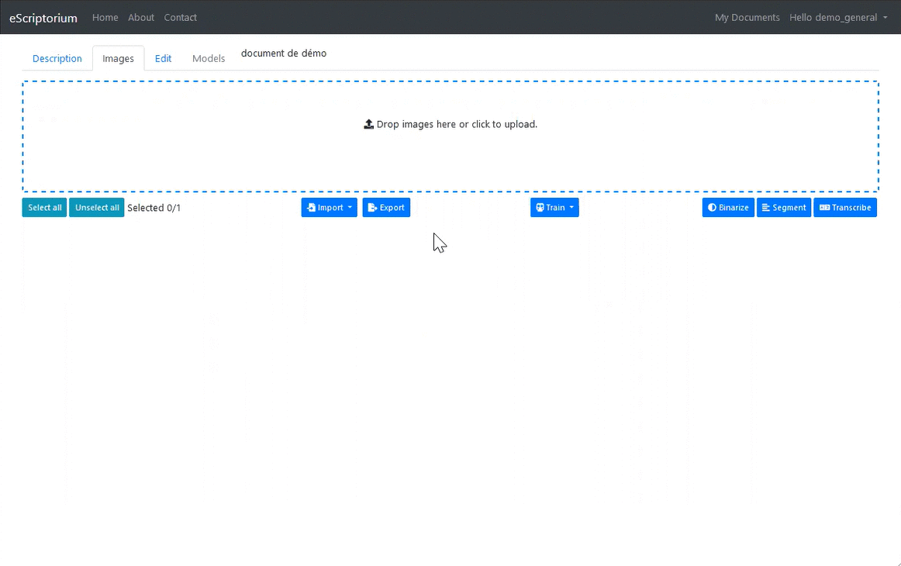
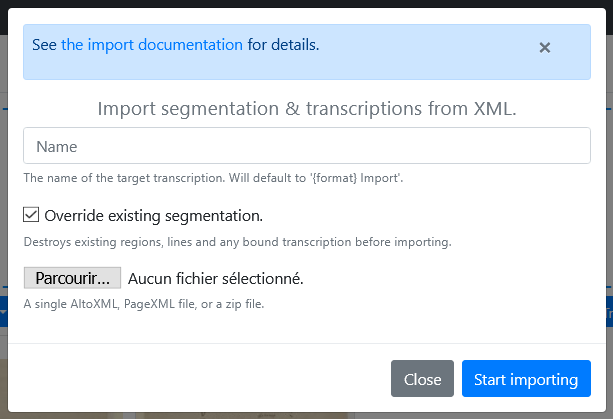

# Walkthrough : import to eScriptorium

eScriptorium allows users to import data from various types of external resources.

## Import images

There three ways to import images into eScriptorium.

### 1. From the local file system

Go to `{base_url}/document/{document-id}/images/` to access the main dashboard to control images. A rectangle defined by a dashes blue border is displayed at the top of the window.  

Simply load the files using drag-and-drop or click in the box to open the file explorer.  

!!! Note  
    You must wait until all the images are loaded before refreshing the page!

!!! Tip
    Images are imported following the selection order. If pages order is important to your project, make sure to select the images in the correct order.

### 2. From a PDF

Go to `{base_url}/document/{document-id}/images/` to access the main dashboard to control images. Locate the "**Import**" button just under the drag-and-drop rectangle. Click on the "**Import**" button, then "**Images (PDF)**" option to load a PDF file and automatically extract the images.  

!!! Note
    Only the images are imported. If the PDF contains a text layer corresponding to the transcription, it is not imported.

### 3. From IIIF

Go to `{base_url}/document/{document-id}/images/` to access the main dashboard to control images. Locate the "**Import**" button just under the drag-and-drop rectangle. Click on the "**Import**" button, then the "**Images (IIIF)**" option, then enter the URL of an IIIF manifesto. All the images associated with the manifesto are then copied locally, as well as the metadata, which is visible in the "**Description**" tab.

!!! Tip inline end
    Example URL to try the IIIF import feature: [https://gallica.bnf.fr/iiif/ark:/12148/btv1b53026595r/manifest.json](https://gallica.bnf.fr/iiif/ark:/12148/btv1b53026595r/manifest.json)

## Import models

Segmentation and Transcription models trained with Kraken can be imported from the "My Models" page (`{base_url}/models`), which lists the models accessible to a user. Such models could be trained by the user, shared with them or uploaded by them.  

Click "Upload a model" to open a page where you can:

1. open the file browser to select the desired .mlmodel file.
2. (opt) give a name to the model.

Click "Upload". The model now appears in the models list.

<!-- todo: add illustration? -->

## Import segmentation and transcription

It is possible to import a layout information, with or without transcription, from XML files.

Go to `{base_url}/document/{document-id}/images/` to access the main document dashboard. Locate the "**Import**" button just under the drag-and-drop rectangle. Click on the "**Import**" button, then the "**Transcriptions (XML)**" option.  

A pop-up allows you to set several actions before clicking "Start importing":

- Specify a name for the transcription extracted from the XML files. This name will appear in the list of transcription versions available for the document. <!-- todo: add link to the subsection about transcription version -->
- Check the "override" option, which will have the existing segmentation removed and replaced with the imported segmentation. If unchecked, the segmentation imported from XML files will be added to the existing segmentation.
- Select the file (one at a time) to import from the file browser. This file can be a single ALTO XML or PAGE XML file, as well as a ZIP file containing several XML files.

!!! Note
    It is not necessary to select the pages which will be affected by the segmentation import: the mapping is automatically calculated based on the image file name and the information contained in the XML files.  

!!! Tip  
    When importing XML files generated with other tools such as Transkribus, it can be usefull to run a segmentation task targetting only the line masks <!-- todo: add link to mask recalculation --> or to preprocess the file with a tool such as [LSS](https://github.com/ponteineptique/lss).[^lss]

[^lss]: Layout Segmentation Simplifier.