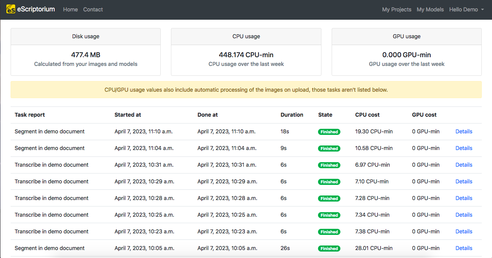

# Walkthrough : predict with eScriptorium
In eScriptorium, it is possible to automatically generated a transcription or a segmentation, i.e. to predict it, generally after you [trained a model](walkthrough_train.md) for it. This prediction, whether it is of the segmentation or the transcription, is managed from the "Images" tab: `{base_url}/document/{document-id}/images/`

## Predict the segmentation
In the "Images" tab, select the image(s) you would like to see segmented by ticking the checkboxe(s) in the top-left corner of the image thumbnail. Then, click on the "Segment" button, at the right of the page. A pop-up box will appear, which will give you the possibility to configure the segmentation you want for your images, thanks to three dropdown menus:

- The first menu gives you the possibility to choose the segmentation model you want to used for your prediction.  
- The second menu allows you to manage what level of segmentation is carried out:
    - “Line and Regions” leads to the generation of zones (provided that the model used has been trained for this), baselines and associated polygons.
    - “Line Baselines and Masks” leads to the generation of baselines and associated polygons.
    - “Only line Masks” does not require loading a model; this option allows you to reset on the fly the calculation of the polygons associated with the baselines already present on the images.
    - “Regions” makes it possible to keep intact the baselines and polygons already present on the images and to generate only the zones.
- The third menu is used to indicate the reading direction of the lines:
    - Horizontal l2r = Latin script texts, read horizontally from left-to-right.
    - Horizontal r2l = Arabic script texts, read horizontally from right-to-left.
    - Vertical l2r = Vertical script texts read from left-to-right.
    - Vertical r2l = Vertical script texts read from right-to-left.

Finally, after chosing your configuration, you have a checkbox called "Override", which is there in case the document has already been segmented and you apply a new prediction. By ticking the checkbox, you chose to erase the existing segmentation and, if it existed, the transcription already applied to the images.

!!! warning
    By default, the checkbox is ticked, so be careful to untick it if you don't want to erase the existing segmentation.

After you finish configuring everything, click on "Segment" and it will start the process of segmentation, as you can see by the yellow boxes that were added above the blue boxes for "Edit" on the thumbail of the images. Once the prediction is finished, the yellow boxes disappeared from the thumbnail and a message in a green box appears in the top-right corner, under the menubar.

!!! Note
    As the segmentation is done page by page, the green message will appear as soon as the first image chosen is segmented. Then, if you have more than one image segmented, a number in parenthesis will appear next to the "Segmentation done!" message and every time a new segmentation is finished, the number will go up, until all of the selected images has been segmented.

## Predict the transcription
In the "Images" tab, select the image(s) you would like to see transcribed by ticking the checkboxe(s) in the top-left corner of the image thumbnail. Then, click on the "Transcribe" button, at the far right of the page, under the corner of the "Drop image" bloc. A pop-up box will appear and you will be able to choose the model you want to apply to the images you selected.  
After you chose it, click on "Transcribe" and it will start the process of transcription, as you can see by the yellow boxes that were added above the blue boxes for "Edit" on the thumbail of the images. Once the prediction is finished, the yellow boxes disappeared from the thumbnail and a message in a green box appears in the top-right corner, under the menubar.

!!! Note
    As the transcription is done page by page, the green message will appear as soon as the first image chosen is transcribed. Then, if you have more than one image transcribed, a number in parenthesis will appear next to the "Transcription done!" message and every time a new transcription is finished, the number will go up, until all of the selected images has been transcribed.

## Task reports and task monitoring
### Task reports
You can have access to this page from the "Images" tab by clicking, in the navbar, on your username and selecting "Task reports" or by following this URL: `{base_url}/quotas`.

The "Task reports" page allows you to have information, firstly, about the disk, CPU and GPU usage of your profile. Then, you have a report of the tasks made on your profile (segmentation, transcription, training, etc.) with the dates and hours of the start and end of the task, its duration, its state (finished, canceled, etc.), the CPU and GPU costs of the task and some extra "Details".

### Task monitoring
You can have access to this page from the "Images" tab by clicking, in the navbar, on your username and selecting "Task monitoring" or by following this URL: `{base_url}/document/tasks`.

The "Task monitoring" page allows you observe all the tasks that were done on your profile, with information about the name of the task, the user who has done it, statistics about how much was done and in what state, a timeline of it and the possibility to to some action on it. It is also possible to filter the results by document or by the state of the task (All, Queued, Running, Crashed, Finished, Canceled).

