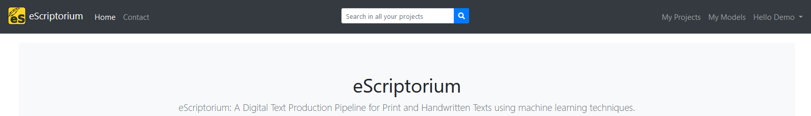

# Walkthrough: search in eScriptorium

!!! warning
    The section needs to be completed.

## Activate search

By default, Search is deactivated on eScriptorium. This is because the feature relies on [ElasticSearch](https://www.elastic.co/fr/elasticsearch/), which may not be compatible with every set up. It is up to the administrator of the server to decide whether or not to activate Search on the application.

If you run eScriptorium on your own machine and want to activate the Search feature, you can take a look at the corresponding [developer documentation](https://gitlab.com/scripta/escriptorium/-/wikis/Environment-variables#search-with-elasticsearch-).

When Search is activated, it appears as a search bar in the middle of the navigation bar, at the top of the page.

The results of the query will be displayed as a list of text extracts along with the corresponding line of text.  

## Use search

You can start a quick search using the search bar in the navigation bar, or you can access the more advanced search interface via `{base_url}/search/`.

A search query can be performed in all the projects at once, or inside only one project.  

- if you start a query from any page but a project's page, the query will be launched on all of your projects.
- if you start a query from a page inside a project, the query will by default be launched on that project only.
- the "advanced" search page allows you to set specify the scope of the query manually ("`All Projects`" or "`{project_name}`)

!!! Tip
    It is possible to reduce the scope of a query to inside a [transcription version](walkthrough_transcribe.md#transcription-versions) when starting a query at document level.

!!! Note "Patience"
    A transcription is not immediately available to search since it needs to be indexed by ElasticSearch. For this reason, you shouldn't expect the query to return anything if you have just uploaded your transcription or applied a transcription model.

## Search matches

Results will contain exact matches (1), fuzzy matches (2) or contextual matches (3).  

Fuzzy matches include different cases, but also textual variation ("testaments" is a match to the "testament" query). Currently, it is not possible to tune how strict the fuzzy matching should be.  

Contextual matches are lines who's context (previous or next line) contain the query.  

, fuzzy matches (2) and contextual matches (3).")
