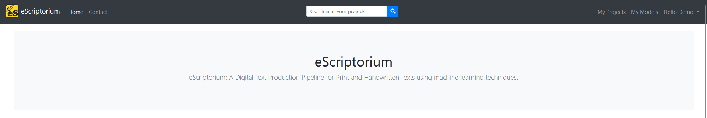
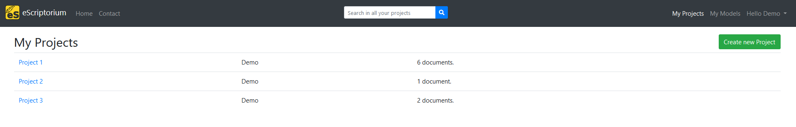
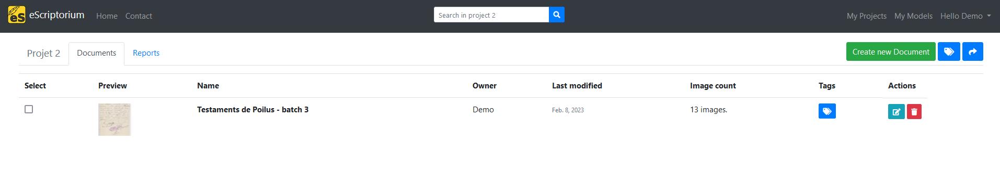
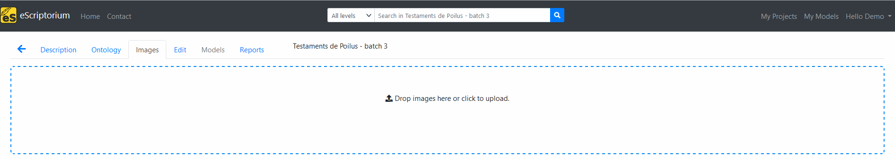
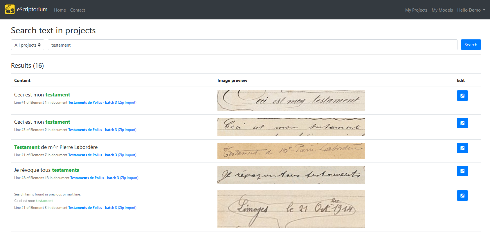
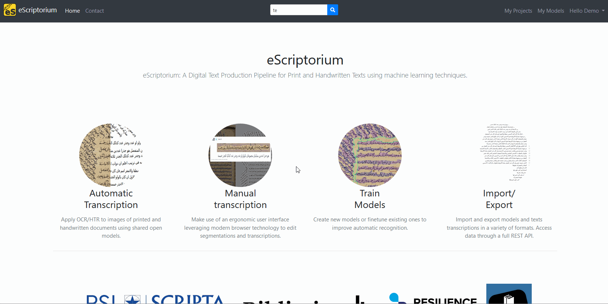

# Walkthrough: search in eScriptorium

!!! warning
    The section needs to be completed.

## Activate search

By default, search is deactivated on eScriptorium. This is because the feature relies on [ElasticSearch](https://www.elastic.co/fr/elasticsearch/), which may not be compatible with every set up. It is up to the administrator of the server to decide whether or not to activate search on the application.

If you run eScriptorium on your own machine and want to activate the search feature, you can take a look at the corresponding [developer documentation](https://gitlab.com/scripta/escriptorium/-/wikis/Environment-variables#search-with-elasticsearch-).

When search is activated, it appears as a search bar in the middle of the navigation bar, at the top of the page. The search bar includes different options depending on the page.  

## Search scope

A search query can be performed in all the projects at once, or inside only one project, or, withing a document, on a specific [transcription version](walkthrough_transcribe.md#transcription-versions).

On the home page and on the "My Project", the scope of the search will be, by default, set to "all projects", has mentioned in the search hint.

On a project's dashboard, the scope of the search will be, by default, set to the current project, has mentioned in the search hint.

On a document's dashboard, a selection menu allows you to narrow the search down to a specific [transcription version](walkthrough_transcribe.md#transcription-versions), or, as set by default, to apply it to all the transcription version available for the current document.

The results of the query will be displayed as a list of text extracts along with the corresponding line of text.  

## Using search

To use the search feature, type your query in the search bar and click on the magnifying glass. You will be taken to a new page displaying the results as a table:

- the first column shows the text contained in the matched line (the exact match is highlighted), as well as some context: the document, the transcription version, the document part and the line number. In some case, this column also shows the content of the previous line;
- the image corresponding to the line that matched the query;
- a button to go to the document part that contained the line matching the query.

It is possible to filter the results by projects using the drop down menu at the top of the page. You can also modify the query by changing the text in the search bar. To apply the filter or update the query string, simply click on the "search" button.

## Fuzzy matches

Results will contain exact matches (1), fuzzy matches (2) or contextual matches (3).  

Fuzzy matches include different cases, but also textual variations ("testaments" is a match to the "testament" query). Currently, it is not possible to tune how strict the fuzzy matching should be.  

Contextual matches are lines whose context (previous or next line) contain the query.  

, fuzzy matches (2) and contextual matches (3).")

!!! Tips
    Using `"` allows you to search for an exact expression. `Royal canin` will return all the lines matching "royal" or "canin", whereas `"Royal canin"` will return the lines matching the expression.

## Indexation delays

A transcription is not immediately available to search since it needs to be indexed by ElasticSearch. For this reason, you shouldn't expect the query to return anything if you have just uploaded your transcription or applied a transcription model.
