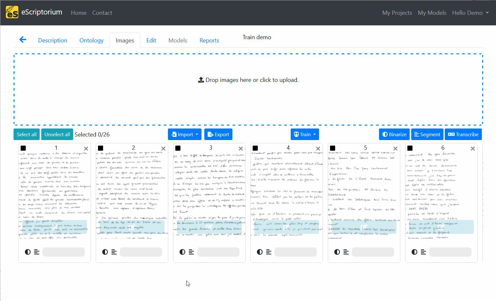
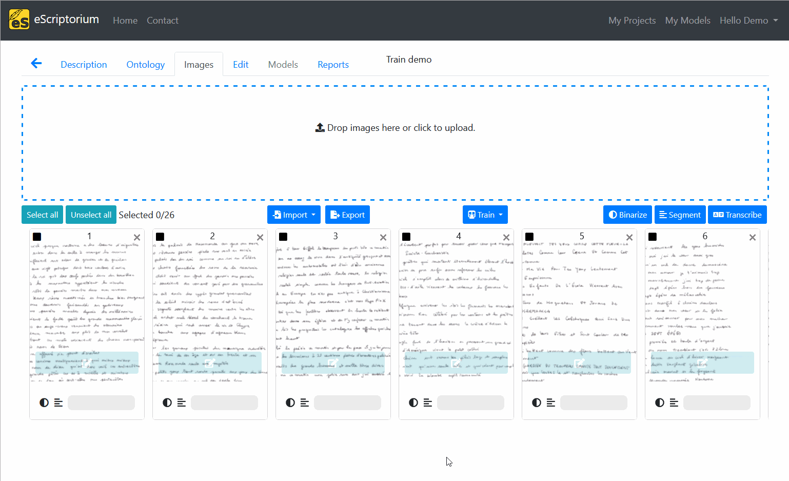
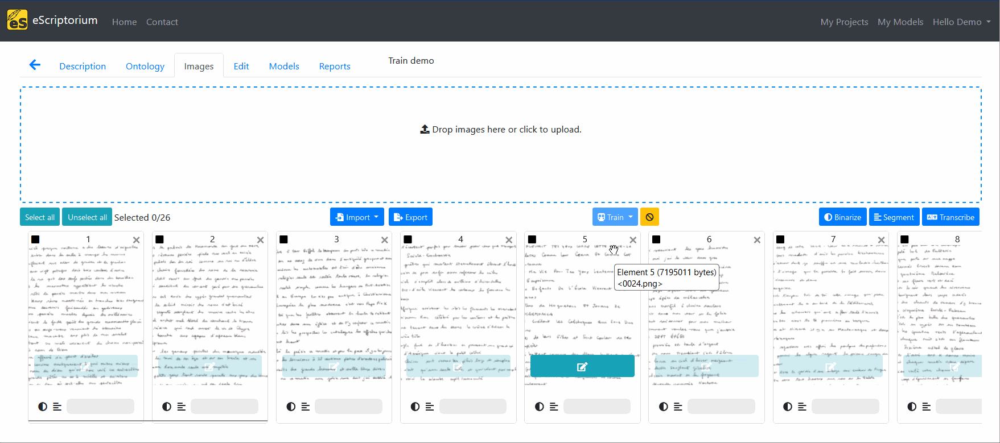
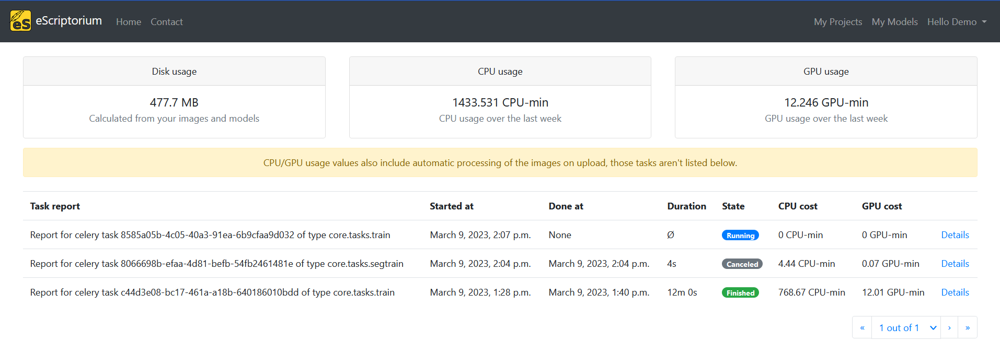

# Walkthrough: training models with eScriptorium

!!! warning
    The section needs to be completed.

## Training rights

Training models starts from the "Images" tab (also accessible at `base_url/document/{doc_id}/images`). By default, not every user have the right to train models.

- If you do, a "Train" button will be displayed on a document's dashboard.

- If you don't, the button won't be visible and you will not be able to start a training task through the [API](walkthrough_api.md)

If you are the administrator of your application you can activate this right in the [back-end](walkthrough_administrators.md#back-end). Otherwise, you should simply get in touch with the administrator of the server you are using.

## Train a transcription model

To train a transcription model in eScriptorium, you need to possess transcriptions ([ground truth](#ground-truth)). All the mobilized images/transcriptions must be in the same document.

From the "Images" tab:

- Select the document parts you want to use to train the model,
- Click on "Train", then select "Recognizer",
- In the form, select the [transcription version](walkthrough_transcribe.md) <!-- target transcription version in particular -->, give an explicit name to your new model and/or select an existing model to perform [fine tuning](#fine-tuning),
- Once the form is filled, click on "Train".

The training task is now placed in a queue and will start soon. When training is finished, you will receive a notification.  

!!! Warning
    We do not recommend checking the "Overwrite the existing model file" since it will erase the original model.

## Train a segmentation model

To train a segmentation model in eScriptorium, the process is the same as previously described. You need [training data](walkthrough_segment.md) to train a segmentation model. All the mobilized images/segment annotations must be in the same document.  

From the "Images" tab:

- Select the document parts you want to use to train the model,
- Click on "Train", then select "Segmenter",
- In the form, give an explicit name to your new model and/or select an existing model to perform [fine tuning](#fine-tuning),
- Click on "Train"

!!! Tip
    Fine tuning [blla.mlmodel](https://github.com/mittagessen/kraken/blob/master/kraken/blla.mlmodel), Kraken's default segmentation model, works better than training a segmentation model from scratch.  

!!! Warning
    We do not recommend checking the "Overwrite the existing model file" since it will erase the original model.

## Training parameters

eScriptorium relies on Kraken's default parameters for training. Such parameters can be found browsing [Kraken's documentation](https://kraken.re/). However, it is important to note that **when [fine tuning](#fine-tuning) a model, Kraken inherits the base model's training parameters**.

If you want to use more advanced training parameters, you should consider using Kraken in command line.  

## Monitoring training

Training can take several hours, you can normally monitor the evolution of a training task using two different approaches.

### Using model listings  

There are two ways to access a list of models:

- in the "My Models" page (also accessible via `{base_url}/models`), all the models belonging to or shared with a user are listed.  
- in a document's "Models" tab, only the models associated with the current document are listed.  

In both of these display, you can see the "Training Status" of a model: either currently training or "done".  

When a model is trained on eScriptorium, you can see the models resulting from each [epoch](#epoch) by clicking on the "Toggle Versions" button. It will display a list of all the epochs along with their [accuracy](#accuracy-and-errors) (and corresponding error count). It is then possible to download each model as an individual file.

eScriptorium follows Kraken's behavior when selecting the best model. It is not always the model with the highest score since the selection is designed to minimize [overfitting](#overfitting).

### Using task reports

[Task reports](walkthrough_users.md#task-reports) provide users with more detailed information on various tasks, including training.  

It displays information about the status of the task (queued, running, finished, crashed, canceled), its execution time and the resources used to complete it (CPU/GPU). You can click on "Details" to get more information on the task.  

---

## Vocabulary

Training is one of the tasks for which a basic knowledge in machine learning is useful if not mandatory. We propose to gather a few definitions in this section.

You can also directly read Kraken's documentation to find out more about some of its behaviors.

### Ground Truth

Ground truth is another way to call the training data. Ground Truth is considered to be the most perfect transcription expected from a transcription model and according to the transcription guidelines defined by a project.  

### Epoch

In machine learning, a model iterates over the training dataset several times. Each iteration on the training set is called an epoch. At the end of each epoch, Kraken models assess their performance against a testing set and adjust their learning strategy. To assess the performance of a model, an [accuracy](#accuracy-and-errors) rate is calculated.  

### Fine tuning  

Fine tuning is the act of re-training a model on a new dataset, as opposed to training a model "[from scratch](https://kraken.re/master/ketos.html#from-scratch)" (using only training data).  

You can check [Kraken's documentation on Fine tuning](https://kraken.re/master/ketos.html#fine-tuning) to better understand its default behavior.

### Overfitting

Overfitting is a common problem in machine learning. It designates the fact that a model seems to perform very well when tested on the training and testing data while failing to generalized to other examples. In some ways, it is as if the model learns "by heart" the training examples and becomes incapable to using the knowledge to new lines of text.  

You can find more information on Kraken's ways to handle overfitting [here](https://kraken.re/master/training.html#training).

### Accuracy and Errors

A **Transcription model** accuracy is calculated at character level. It corresponds to the number of correctly recognized characters over the total number of characters to recognize. If a model has an accuracy of 90%, it will correctly recognize 9 characters out of 10.  

The errors are expressed in eScriptorium as the total number of deleted/inserted/substituted characters over the total number of characters recognized by the model. Such a ratio is the basis to compute the [CER](https://towardsdatascience.com/evaluating-ocr-output-quality-with-character-error-rate-cer-and-word-error-rate-wer-853175297510) of a model, also known as "Character Error Rate".  

If a model makes 330 errors out of 3330 characters to recognize, its CER will be equal to $\frac{330}{3330} \times 100$, which is 9.90%.

The CER is inversely proportional to the accuracy: if a model has a character accuracy of 90%, it also has a CER of 10%.

Even though eScriptorium offers a simple accuracy rate for **Segmentation models**, such metric is generally computed at pixel level (via [IoU](https://en.wikipedia.org/wiki/Jaccard_index) for example), which is less meaningful. For this reason, a segmentation model with an accuracy of 60% might still be a rather good model. It is usually necessary to try.  

As stated in [Kraken's best practices for segmentation](https://kraken.re/master/ketos.html#segmentation-model-training):

> - Segmentation models’ performance are difficult to evaluate. Pixel accuracy doesn’t mean much because there are many more pixels that aren’t part of a line or region than just background. Frequency-weighted IoU is good for overall performance, while mean IoU overrepresents rare classes. The best way to evaluate segmentation models is to look at the output on unlabelled data.
> - If you don’t have rare classes you can use a fairly small validation set to make sure everything is converging and just visually validate on unlabelled data.

!!! Note
    Kraken's segmentation models can be used for two distinct tasks: detecting lines and/or detecting regions. The accuracy rate displayed in eScriptorium might not correctly express how well (or bad) the model executes one task or the other.  
