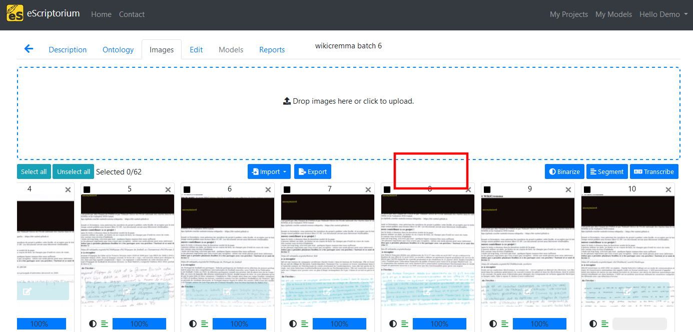

# Walkthrough : train models with eScriptorium

!!! warning
    The section needs to be completed.

## Training rights

By default, not every user have the right to train models.

- If you do, a "Train" button will be displayed on a document's dashboard.

- If you don't, the button won't be visible and you will not be able to start a training task through the [API](walkthrough_api.md)

If you are the administrator of your application you can activate this right in the [back-end](walkthrough_administrator.md#back-end). Otherwise, you should simply get in touch with the administrator of the server you are using.

## Transcription models

## Segmentation models

