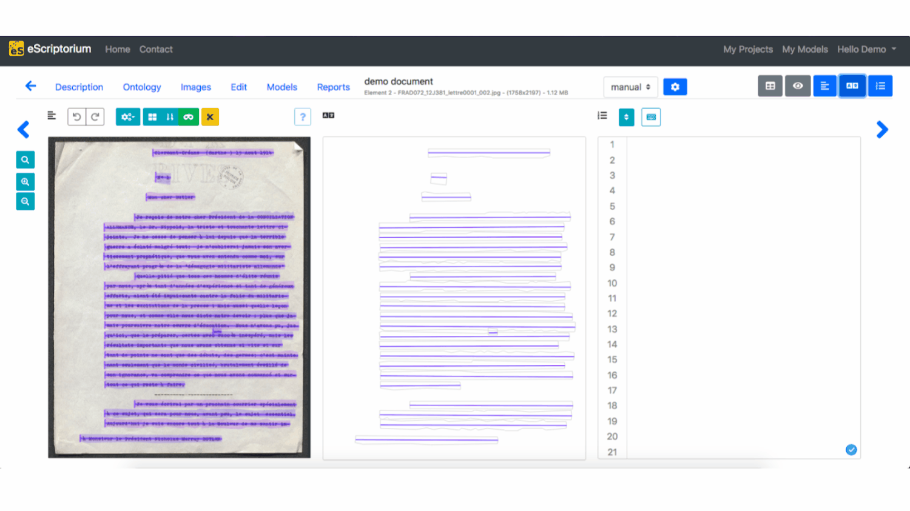
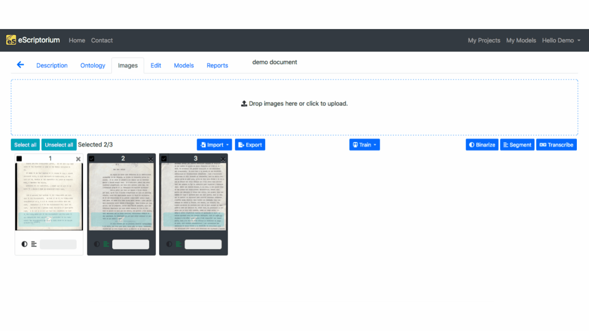

# Walkthrough : transcribe with eScriptorium

!!! warning
    The section needs to be completed.

Once the [segmentation of the images](walkthrough_segment.md) have been achieved and [some annotations](walkthrough_annotate.md) have been added if needed, the next step in eScriptorium will be the text recognition of the documents.  
This step can be done manually, whether it is by hand, by copying it from a text output or by importing an XML transcription, or automatically, with a model and manual correction. 

## Manual transcription
For the manual transcription, there are two panes that can be used: "Transcription", that will display the transcription as it is presented in the images, and "Text", that will display the transcription as a plain succession of text lines according to the order from the segmentation.

### Transcription by hand
When the transcription has to be done by hand, the best option is to use the "Transcription" pane.  
To add a transcription associated with a segment, click on the corresponding zone. An input window is displayed. To record a transcription, press “Enter”: the transcription interface automatically displays the input field for the next segment.

### Transcription by copy/paste
When the only available format of the transcription is text, it is possible to add it rapidly and easily on eScriptorium.  
To do so, make sure that the "Text" pane is open. Then, from the text file of your transcription, copy the portion of text present in the image. You can then check, with the "Transcription" pane if everything correspond to the image.

If the transcription is not exactly right, you have the possibility to modify the transcription of the lines through one of the two panes.

### Transcription by import
When the transcription is available in an XML format, whether it is ALTO or PAGE, it is possible to add it to eScriptorium, via the 'Import' option.  
This process and its documentation can be found in [this page](walkthrough_import.md).

## Automatic transcription
The automatic transcription will be done with a model. It can be a model you have trained yourself, [on eScriptorium](walkthrough_train.md) for example, or a model that were suited for your documents and that you may have found on the [Zenodo repository dedicated to OCR/HTR models](https://zenodo.org/communities/ocr_models/). If it was trained on eScriptorium, the model will already be available in the interface but otherwise, you will have to import it beforehand, by following the instructions detailed [here](walkthrough_import.md).

### Application of the text recognition model
In the "Images" tab, select the images you would like to see transcribed by checking the box in the top-left corner of the image thumbnail. Then, click on the "Transcribe" button, at the far right of the page, under the corner of the "Drop image" bloc. A window will appear and you will be able to choose the model you want to apply to the images you selected. After you chose it, click on "Transcribe" and it will start the process of transcription, as you can see by the yellow boxes that were added above the blue boxes for "Edit" on the thumbail of the images. Once the application of the model is finished, the yellow boxes disappeared from the thumbnail and a message appeared in the top-right corner, under the menubar.

### Manual correction of the transcription

## Virtual Keyboard

- Virtual Kabbage --> a voir avec Alix

## Compare transcriptions

## Note on text normalization

