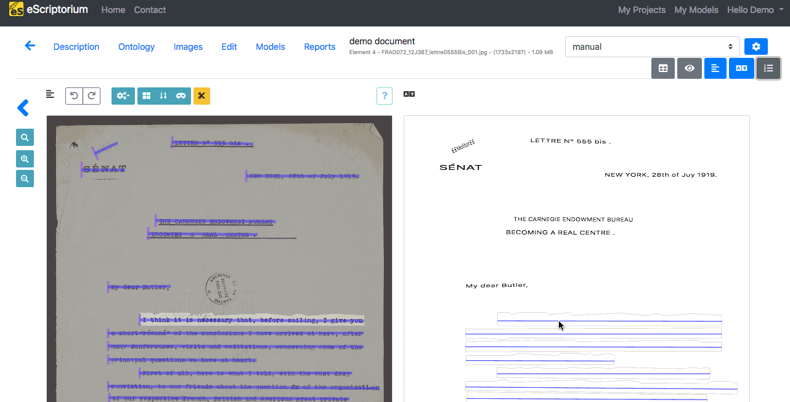
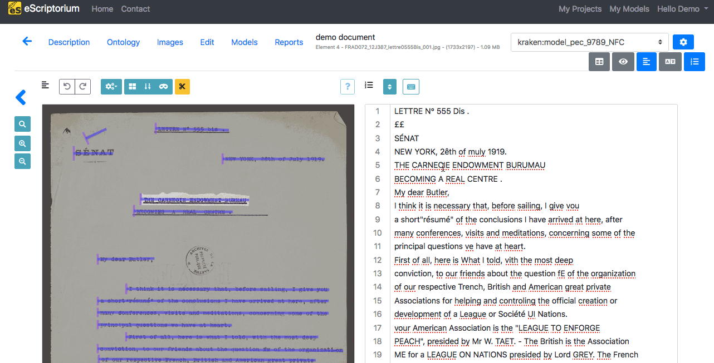
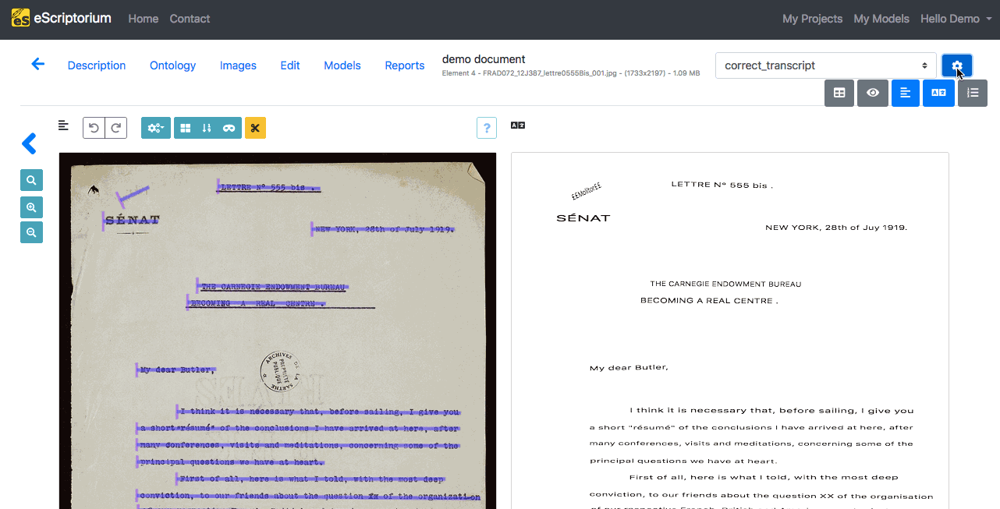
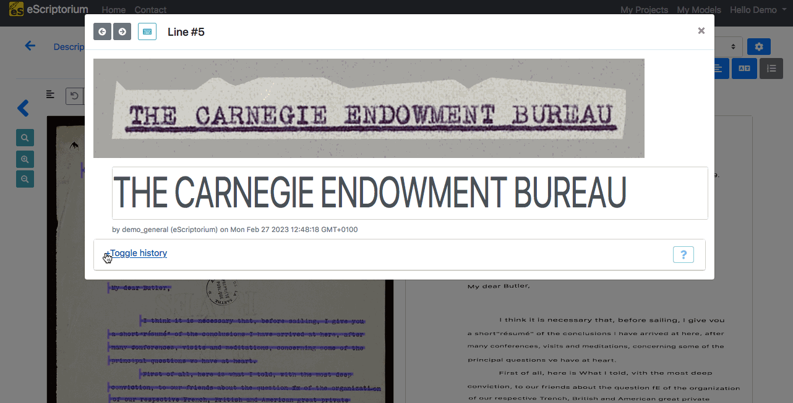

# Walkthrough: transcribe with eScriptorium

Once the [segmentation of the images](walkthrough_segment.md) have been achieved and [some annotations](walkthrough_annotate.md) have been added, if needed, the next step in eScriptorium will be the text recognition of the documents and it is possible to do this step manually or automatically.

## Automatic transcription

### Obtaining a model
You need a model to transcribe automatically, here are some ways to get one:  

- by [training one with eScriptorium](walkthrough_train.md) or (via the command line) with [kraken](https://kraken.re),
- by having one shared with you, either within [eScriptorium](walkthrough_collaborate.md#share-a-model), or sent to you as a file through other means of communication,
- by importing a model from a file. Such files can be retrieved on the [Zenodo community](https://zenodo.org/communities/ocr_models/) dedicated to Kraken models.

### Predicting the transcription

To learn how to apply the text recognition model and obtain a prediction, see the section ["Predict a segmentation or a transcription"](walkthrough_predict.md)

## Manual transcription
To work on the transcription manually, you will have to be on the "Edit" tab of your document, which is available either by clicking on the "Edit" button once you are in your document or in a square when you hover upon the thumbnail of an image once your are in the following URL: `{base_url}/document/{document-id}/images/`.

There are two panels, in eScriptorium, where you can create and edit the transcription: "Transcription" and "Text".

### The "Transcription" panel
This panel will display the transcription as it is structured in the image.
")  

To start transcribing, click on the line you want to edit (it will be highlighted in the "Image" panel). An input window is then displayed. To record a transcription, press ++enter++: the transcription interface automatically displays the input field for the next segment.

You can also modify your transcription, once it is done. To do so, the technique is the same as for the manual transcription: you click on the line, modify what is necessy and then press ++enter++.

### The "Text" panel
This panel will display the transcription as a plain succession of text lines, according to the order from the segmentation.
")

To start transcribing, click on the line you want to edit (it will be highlighted in the "Image" panel). To record a transcription, press ++enter++: the cursor will go to the next line and the "Save" icon will appear above your transcription, indicating that it is registering your changes.

You can also modify your transcription, once it is done. To do so, the technique is the same as for the manual transcription: you click on the line, modify what is necessy and then press ++enter++.

  

!!! Tip
    If you need to had special characters in your transcription and they are not available on your own keyboard, you can set and use a [virtual keyboard](walkthrough_virtual_keyboard.md).

## Transcription versions

### Manage transcriptions

!!! Warning
    Currently, you cannot manually create a new transcription version.

A document can be associated simultaneously to several versions of transcription. Each version has its own name.  

- There is always a default one named "manual"
- Predicting a transcription with a model will create a new transcription version named after the model (ex kraken:demo_model)
- Importing a transcription from an XML file will create a new transcription version named after the name set during [import](walkthrough_import.md) or the import name by default, "Zip Import".

!!! Warning
    Segmentation, on the contrary, has only one version (see [here](walkthrough_segment.md)).

To display the list of versions of transcription available, click on the drop-down menu in the top-right corner and choose the version you want to see.

To delete a transcription version, click on the "Transcription management" button (blue button with the gear) in the top-right corner. The "Delete" button will delete the chosen version irrevocably for all the images of the document.

!!! Warning
    Even when a text recognition model is applied to one of the document's page, the new version will be created at document level. This means that, even if the display is at document-part level, the creation or **deletion** of a transcription version will impact all the images of the document.

### Keep track of the modifications of a transcription
!!! Warning
    This is only available in the "Transcription" panel.

It is possible to keep track of the changes made on a transcription line by line. To do so, you can click on one line from the transcription and select `+Toggle history` with which you can see the changes made.

### Compare transcriptions
!!! Warning
    This is only available in the "Transcription" panel.

It is possible to compare several versions of a transcription.  
First, choose the base version you want, i.e. the one version others will be compared to. To do so, select it as the displayed version in the Transcription panel.  
Then, click on the "Transcription management" button in the top-right corner. Choose the versions you want to compare by ticking the checkboxes under "Compare", then close the pop-up box, by clicking on the cross or simply by clicking somewhere on the page. Then, select any line in the "Transcription" pane and click on "+Toggle transcription comparison" to see the difference.  
The parts in red indicate the deleted characters and those in green indicate the added characters.

