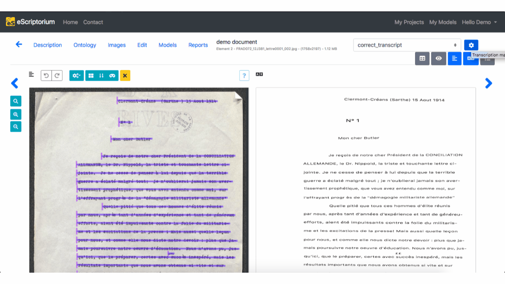

# Walkthrough : transcribe with eScriptorium

Once the [segmentation of the images](walkthrough_segment.md) have been achieved and [some annotations](walkthrough_annotate.md) have been added, if needed, the next step in eScriptorium will be the text recognition of the documents.  
This step can be done manually or automatically. Automatic text recognition is performed with a model (although you may still need some manual correction afterwards). Manual transcription can be done by typing to the text directly in the interface, by copying and pasting text or by [importing XML transcriptions](walkthrough_import.md).
## Manual transcription
For the manual transcription, two panels can be used: "Transcription", that will display the transcription as it is structured in the images, and "Text", that will display the transcription as a plain succession of text lines, according to the order from the segmentation.

")

")

### Transcription by hand
When the transcription has to be done by hand, the best option is to use the "Transcription" panel.  
To start transcribing, click on the corresponding zone. An input window is displayed. To record a transcription, press “Enter”: the transcription interface automatically displays the input field for the next segment.

### Transcription by copy/paste
When the only available format of the transcription is text, it is possible to add it swiftly on eScriptorium.  
To do so, make sure that the "Text" pane is open. Then, from the text file of your transcription, copy the portion of text present in the image. You can then check, with the "Transcription" pane if everything correspond to the image.

!!! Note
    If the transcription does not match the segmentation of the image, you have the possibility to modify the transcription in the lines through one of the two panes, until it matches completly.

## Automatic transcription
1. You need a model to transcribe automatically;
2. There are different ways to have a model: [training on escriptorium](walkthrough_train.md), [share a model](walkthrough_train.md), import a model either (because the model can be shared on [Zenodo](https://zenodo.org/communities/ocr_models/), can be trained in command line with [kraken](https://kraken.re), or can be sent to you by someone else as a file).

### Predicting the transcription
To learn how to apply the text recognition model and obtain a prediction, see the section ["Predict a segmentation or a transcription"](walkthrough_predict.md)

### Editing the transcription
If you want to edit the transcription, click on the "Edit" button, available at `{base_url}/document/{document-id}/images/` or in a square when you hover upon the thumbnail of an image. Make sure that you are on your transcription by checking in the drop-down box in the top-right corner of the page. Once it is done, you can click on the first line and then check, line by line, the transcription and correct it if needed. Press "Enter" to validate the change and go on to the next line.

!!! Tip
    To follow the changes made on the transcription line, you can click on it and select "+Toggle history" in which you can see the changes made.
    

## Virtual Keyboard

!!! warning
    The section needs to be completed.

A virtual keyboard is available in the "Text" pane in the "Edit" tab. To activate it, click on the icon "Toggle Virtual Keyboard for this document", then click on one of the line.  
The virtual keyboard lets you predefine a series of keyboard shortcuts and virtual buttons to facilitate the writing of frequent special caracters. The "Manage Keyboard" button allows the management of this setting, and it is also possible to import a new configuration via a JSON file or a link to a JSON file.

## Transcription versions

### Manage transcriptions
!!! Warning
    Currently, you cannot manually create a new transcription version.
    
A document can be associated simultanously to several versions of transcription. Each version has its own name.  

- There is always a default one named "manual"
- Predicting a transcription with a model will create a new transcription version named after the model (ex kraken:demo_model)
- Importing a transcription from an XML file will create a new transcription version named after the name set during [import](walkthrough_import.md) or the import name by default, "Zip Import".

!!! Warning
    Segmentation, on the contrary, has only one version (see [here](walkthrough_segment.md)).

To display the list of versions of transcription available, click on the drop-down menu in the top-right corner and choose the version you want to see.

To delete a transcription version, click on the "Transcription management" button (blue button with the gear) in the top-right corner. The "Delete" button will delete the chosen version irrevocably for all the images of the document.

!!! Warning
    Even when a text recognition model is applied to one of the document's page, the new version will be created at document level. This means that, even if the display is at document-part level, the creation or **deletion** of a transcription version will impact all the images of the document.

### Compare transcriptions
It is possible to compare several versions of a transcription.  
First, choose the base version you want, i.e. the one version others will be compared to. To do so, select it as the displayed version in the Transcription panel.  
Then, click on the "Transcription management" button in the top-right corner. Choose the versions you want to compare by ticking the checkboxes under "Compare", then close the pop-up box, by clicking on the cross or simply by clicking somewhere on the page. Then, select any line in the "Transcription" pane and click on "+Toggle transcription comparison" to see the difference.  
The parts in red indicate the deleted characters and those in green indicate the added characters.

## Note on text normalization

!!! warning
    The section needs to be completed.
