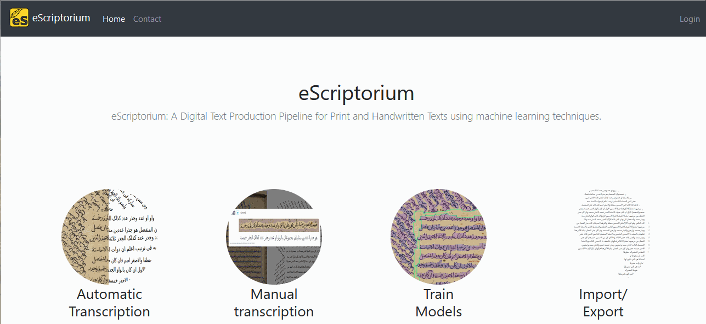
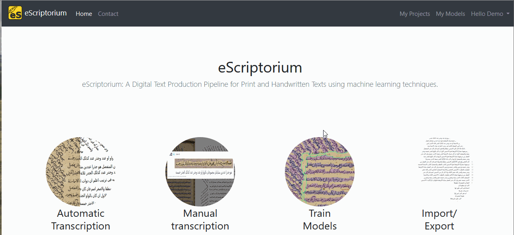
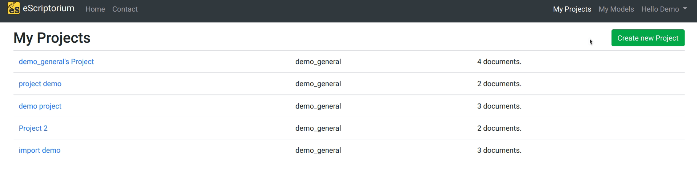
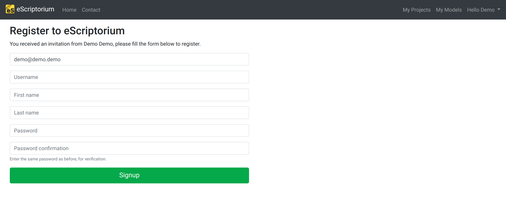

# Walkthrough :  being a user in eScriptorium

!!! warning
    The section needs to be completed.

This section details several features related to being a user on the application.

## Login and Logout

Logging in the application requires a user account, which is associated to several pieces of information:

- Username
- Password
- Email address
- First name and last name

Most pages on eScriptorium are only accessible to logged-in users.

The login page is accessible from any page of the application, in the top-right corner of the navigation bar (or at `{base_url}/login`). A small logging form appears: 

- in "username", type your username (not your email address!), 
- then in "password", type your password.

To log out, go to the menu on the top-right corner and select "Logout".

## Retrieve a lost password or change password

If you lost your password, you can request to receive a link to reset it. On the login page (`{base_url}/login`), click on "Lost password?" before typing the email address associated to your account. You will receive an email containing a link to reset the password.  

If you lost the email address associated to your eScriptorium account, you should get in touch with the administrator of your eScriptorium server.  

You can also change your password directly from the user's menu, on the top-right corner of the navigation bar. Click on "Hello, {first name}" and then on "Change password" (also accessible at `{base_url}/password_change/`). Fill the fields and click on "Change my password".

## Review and edit your profile

Each user can access their profile page which is broken down into five tabs :  

- `Information`: where the user can change their first and last names, as well as their email address.  
- `API Key`: where the user can create, renew or delete an API Authentification Token.  
- `Files`: where every archive generated during a former [export](walkthrough_export.md) can be accessed.  
- `Teams`: where the user can create, manage or leave a [team](#teams).  
- `Invitations`: where the user can see the status of previously sent [invitations](#invite) (provided that they have the right to send invitations).  

## Task reports

!!! Warning 
    The documentation on this feature is not complete.

A user can access information on the tasks they started from the user menu by clicking on "Task Report" page (also accessible at `{base_url}/quotas`). The corresponding page is composed of two elements:  

- Information on recent hardware usage (Disk, CPU and GPU), which is helpful to get an overall idea of your usage of the server.
- A list of all the previous tasks, including information about the date and time of execution, its duration, its state, its CPU or GPU cost. Additionnally, for each item in the list, it is possible to view a more detailed report by clicking on "Details". This is useful when a task fails.

<!-- todo: collect more information on task reports -->

## Task monitoring

!!! Warning 
    The documentation on this feature is not complete.

A user can access the list of all the tasks they started on eScriptorium from the user menu by clicking "Task Monitoring" (also accessible at `{base_url}/documents/tasks/`). The main purpose of this page is to manage tasks and cancel one or several running tasks at once.

??? Note "Task monitoring for administrators"
    Users with administrator rights can view all the running tasks and have an additional filter available based on usernames.

<!-- todo: collect more information on task monitoring -->

## Invite  

Not all users are allowed to send invitations. If you have that right, you will see "Invite" in the user menu on the top-right corner of the navigation bar, or be able to access `{base_url}/invite/`.  

The corresponding page contains a form where the recipient's information can be filled in. Only the email address is mandatory, other information are optional. When a user sends an invitation, they can associate the future user to a team they already belong to.

The signup form looks like this:

## Teams <!-- This section has been relocated to the Collaborate walkthrough. It can be safely deleted here. --> 

Users can be grouped by Teams. The main purpose of a team is to facilitate [sharing documents or projects](walkthrough_collaborate.md). Teams are also helpful to identify a group of people working on the same project or coming from the same institution.  

It is possible to manage teams from the [Profile page](#review-and-edit-your-profile). Team management includes:  

- Creating a team,  
- Leaving a team,  
- Adding or removing members from a team,  
- Transfering ownership to another member.  

Only the owner of a team is allowed to add or remove members or to transfer ownership. The owner of a team cannot leave it without first transferring the ownership to another user.

??? Note "No deleting, no renaming"
    It is currently impossible to delete a team or to rename a team.

??? Note "One owner per team"
    There can only be one owner at a time.  
