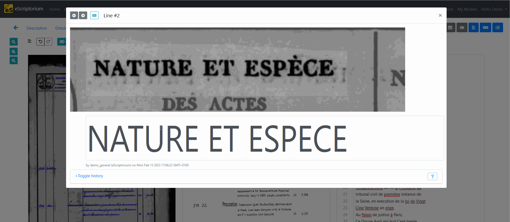
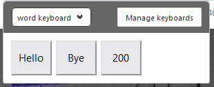

# Walkthrough: eScriptorium's virtual keyboard

## Toggle the keyboard

The virtual keyboard allows you to set a series of special characters to be easily accessible.

Toggling the virtual keyboard can be done in the "Transcription" panel or in the "Text" panel. Click on the "keyboard" button and place the cursor in the text field. As soon as you click the text field, the virtual keyboard will appear.

## Create a virtual keyboard

It is possible to create your own virtual keyboard through the eScriptorium application by clicking "Manage keyboards", available when the virtual keyboard is toggled. Then click on "Create a new keyboard", then "Edit". In the edit panel, you can set the size of the keyboard (number of rows or columns) and configure each key by clicking on it. You can pick a glyph and then optionnaly assign a key binding to the key. Key binding allows you to set key board shortcuts.  

It is possible to export the resulting keyboard configuration into a JSON file which you can share with other users or simply store on your machine to import in another documents.  

To set the new virtual keyboard as your default virtual keyboard, click on "Use" in the keyboard manager window.  

!!! Note
    Virtual keyboard configurations are tied to a document and a user. You need to share your configuration with another user if you want them to have it as well. Similarly, you will need to import or create the virtual keyboard configuration in each of your document.  

## Import a virtual keyboard configuration

Because setting up a whole virtual keyboard can be a long process, or if you want to add non-UTF-8 characters, you can import a virtual keyboard configuration eScriptorium. From the Keyboards manager, simply click on "Import a Keyboard". You can import a JSON file from your local file system, or import a keyboard configuration from a URL.  

## Customize a virtual keyboard

You can use the structure of the JSON export from the demo keyboard as a guideline to manually encode your own keyboard, or you can use tools such as [Virtual-Kabbage](https://github.com/alix-tz/virtual-kabbage) to create yours from a CSV file.  

??? Note "Whole words on the virtual keyboard"
    For often-encountered words or series of letters, you can set a key to render several characters at once. You will need to set this inside the JSON file directly.

    